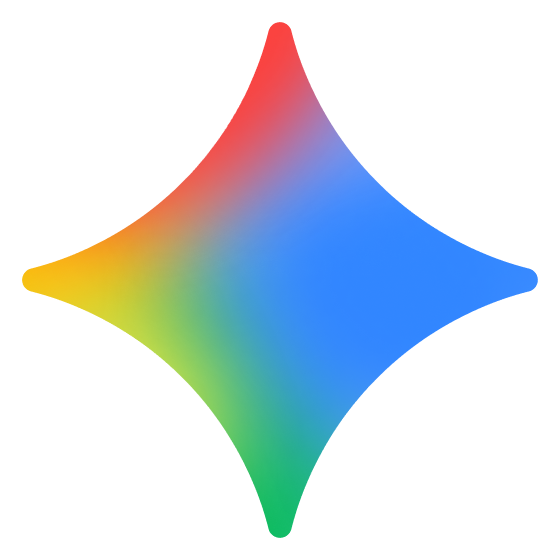

# Model Catalogue

**Platform:** Electron

TaskWraith's model picker is provider-aware: choose a provider, then a model,
the reasoning level it supports, and (where offered) a Fast tier. This page is
the concise, public reference for the curated picker catalogue.

> **Snapshot: 12 August 2026.** Your actual picker is still governed by the
> provider CLI, your account and plan, and (for Ollama) the models installed on
> your machine. Codex is refreshed from its live provider catalogue when
> available; the rows below describe TaskWraith's curated fallback and the
> standard options it presents.

## Reading the catalogue

- **Default** marks TaskWraith's initial selection for a new provider seat.
- **Reasoning** uses the composer's common ladder: **Light**, **Medium**,
  **High**, **Extra**, **Max**, and **Ultracode**. A dash means that model has
  no configurable TaskWraith reasoning control.
- **Fast** is provider-specific: **Toggle** exposes the Fast control in the
  picker, **Included** means the provider's model is always Fast, and **Pair**
  means normal and Fast are separate model rows. Fast availability and pricing
  depend on the provider plan.

The thin colour rail beside each provider is the same provider hue used by the
in-app New Additions notification. The marks are the actual first-party
provider logos from the project's [provider-logo catalogue](design-assets/provider-logos/README.md),
not the monoline glyph set.

## Provider catalogue

<table>
  <tr>
    <td width="10" bgcolor="#705AFF"></td>
    <td width="54" align="center" valign="middle">
      
    </td>
    <td valign="middle"><strong>Codex / OpenAI</strong> Violet provider hue · active for new runs</td>
  </tr>
</table>

| Model                                         | Reasoning                                       | Fast   | Notes                                                            |
| --------------------------------------------- | ----------------------------------------------- | ------ | ---------------------------------------------------------------- |
| **GPT-5.6-Sol** `gpt-5.6-sol`                 | Light · Medium · High · Extra · Max · Ultracode | Toggle | Latest frontier agentic coding model.                            |
| **GPT-5.6-Terra** `gpt-5.6-terra`             | Light · Medium · High · Extra · Max · Ultracode | Toggle | Balanced agentic coding for everyday work.                       |
| **GPT-5.6-Luna** `gpt-5.6-luna`               | Light · Medium · High · Extra · Max             | Toggle | Fast and affordable agentic coding.                              |
| **GPT-5.5** `gpt-5.5` **(Default)**           | Light · Medium · High · Extra                   | Toggle | Default while the GPT-5.6 rollout remains account-dependent.     |
| **GPT-5.4** `gpt-5.4`                         | Light · Medium · High · Extra                   | Toggle | Still offered when directly runnable even if discovery omits it. |
| **GPT-5.4 Mini** `gpt-5.4-mini`               | Light · Medium · High · Extra                   | —      | Smaller GPT-5.4 option.                                          |
| **GPT-5.3 Codex Spark** `gpt-5.3-codex-spark` | Light · Medium                                  | —      | Research preview where available.                                |

<table>
  <tr>
    <td width="10" bgcolor="#B16105"></td>
    <td width="54" align="center" valign="middle">
      
    </td>
    <td valign="middle"><strong>Claude / Anthropic</strong> Clay provider hue · active for new runs</td>
  </tr>
</table>

| Model                                               | Reasoning                                       | Fast   | Notes                                                  |
| --------------------------------------------------- | ----------------------------------------------- | ------ | ------------------------------------------------------ |
| **Opus 5** `claude-opus-5`                          | Light · Medium · High · Extra · Max · Ultracode | Toggle | 1M context by default, adaptive thinking.              |
| **Fable 5** `claude-fable-5`                        | Light · Medium · High · Extra · Max · Ultracode | —      | 1M context, adaptive thinking.                         |
| **Sonnet 5** `claude-sonnet-5` **(Default)**        | Light · Medium · High · Extra · Max · Ultracode | —      | 1M context, extended thinking.                         |
| **Sonnet 4.6 Legacy** `claude-sonnet-4-6`           | Light · Medium · High · Max                     | —      | 200K context legacy Sonnet.                            |
| **Opus 4.8 1M Legacy** `claude-opus-4-8-1m`         | Light · Medium · High · Extra · Max · Ultracode | Toggle | 1M context legacy Opus, extended thinking.             |
| **Opus 4.7 1M Legacy** `claude-opus-4-7-1m`         | Light · Medium · High · Extra · Max · Ultracode | Toggle | 1M context legacy Opus.                                |
| **Haiku 4.5** `claude-haiku-4-5`                    | —                                               | —      | Fast and efficient; no configurable reasoning control. |

<table>
  <tr>
    <td width="10" bgcolor="#0073E6"></td>
    <td width="54" align="center" valign="middle">
      
    </td>
    <td valign="middle"><strong>Kimi / Moonshot</strong> Blue provider hue · catalogued for admitted runtimes; packaged source-ahead builds await a commissioned tuple</td>
  </tr>
</table>

| Model                                          | Reasoning        | Fast               | Notes                                            |
| ---------------------------------------------- | ---------------- | ------------------ | ------------------------------------------------ |
| **K2.7 Coding** `kimi-k2.7-code` **(Default)** | On (fixed)       | Toggle — Highspeed | Thinking is always on.                           |
| **K3** `kimi-k3`                               | Low · High · Max | —                  | 256K on Moderato; up to 1M on Allegretto+ tiers. |

<table>
  <tr>
    <td width="10" bgcolor="#757575"></td>
    <td width="54" align="center" valign="middle">
      
    </td>
    <td valign="middle"><strong>Grok / xAI</strong> Neutral provider hue · active for new runs</td>
  </tr>
</table>

| Model                                               | Reasoning           | Fast     | Notes                                                |
| --------------------------------------------------- | ------------------- | -------- | ---------------------------------------------------- |
| **Grok 4.5 Fast** `grok-4.5` **(Default)**          | Low · Medium · High | Included | 500K-context coding model; Fast is provider-encoded. |
| **Grok Composer 2.5 Fast** `grok-composer-2.5-fast` | —                   | Included | Historical/specialised Fast model row.               |

<table>
  <tr>
    <td width="10" bgcolor="#8D7312"></td>
    <td width="54" align="center" valign="middle">
      
    </td>
    <td valign="middle"><strong>Cursor</strong> Mustard provider hue · managed runs with native and TaskWraith tools</td>
  </tr>
</table>

Managed Cursor is selectable for new runs and supports both Cursor's native
tools and TaskWraith's governed tool gateway. The selected permission posture
and workspace Tool Grants apply to TaskWraith-mediated calls; see
[Trust & Safety](TRUST_AND_SAFETY.md) for provider-native boundaries.

| Model                                                   | Reasoning           | Fast     | Notes                                                 |
| ------------------------------------------------------- | ------------------- | -------- | ----------------------------------------------------- |
| **Composer 2.5 Fast** `composer-2.5-fast` **(Default)** | —                   | Included | Fast route is encoded in the selected model row.      |
| **Composer 2.5** `composer-2.5`                         | —                   | Pair     | Select this normal row or its Fast counterpart above. |
| **Cursor Grok 4.5** `grok-4.5`                          | Low · Medium · High | Toggle   | First-party Cursor model pool with 500K context.      |

<table>
  <tr>
    <td width="10" bgcolor="#308713"></td>
    <td width="54" align="center" valign="middle">
      
    </td>
    <td valign="middle"><strong>AntiGravity / Google</strong> Green provider hue · opt-in, separately billed Gemini API-key lane</td>
  </tr>
</table>

AntiGravity's ordinary bring-your-own-key lane curates the authenticated Gemini
API `models.list` response, so the live picker—not a frozen documentation
table—is authoritative. The current GA highlights are:

| Model                                                               | Reasoning | Fast | Notes                                                       |
| ------------------------------------------------------------------- | --------- | ---- | ----------------------------------------------------------- |
| **Gemini 3.6 Flash** `gemini-api:gemini-3.6-flash`                  | —         | —    | Latest balanced model for agentic and multimodal work.      |
| **Gemini 3.5 Flash** `gemini-api:gemini-3.5-flash`                  | —         | —    | Sustained frontier performance for agentic and coding work. |
| **Gemini 3.5 Flash-Lite** `gemini-api:gemini-3.5-flash-lite`        | —         | —    | Lowest-cost 3.5 model for high-throughput execution.        |

When live discovery cannot be verified, TaskWraith can retain bounded fallback
rows from the 3.1 and 2.5 families so the configured provider does not vanish;
dispatch still reports an ordinary API error if a stale row is no longer
accepted. The separately consented `agy` CLI lane is intentionally absent from
this fixed table and appears only after its own authenticated discovery. See
Google's [Gemini API model catalogue](https://ai.google.dev/gemini-api/docs/models)
for the upstream lifecycle.

<table>
  <tr>
    <td width="10" bgcolor="#1671EA"></td>
    <td valign="middle"><strong>Muse Code / Meta</strong> Meta blue provider hue · active for new runs</td>
  </tr>
</table>

| Model                                             | Reasoning                                       | Fast | Notes                              |
| ------------------------------------------------- | ----------------------------------------------- | ---- | ---------------------------------- |
| **Muse Spark 1.2** `muse-spark-1.2` **(Default)** | Light · Medium · High · Extra · Ultracode | —    | 200K context · $1.25/$4.25 per Mtok. |

Muse's model lifecycle is provider-published from the local Muse CLI catalogue,
so the live picker follows the CLI's own current-model set; the row above is
TaskWraith's curated fallback. Muse's own picker labels its stops **Minimal ·
Low · Medium · High · Extra High · Ultra**; the Reasoning column above maps
them onto the shared ladder vocabulary.

<table>
  <tr>
    <td width="10" bgcolor="#1A8562"></td>
    <td width="54" align="center" valign="middle">
      
    </td>
    <td valign="middle"><strong>Ollama / local</strong> Green provider hue · active when Ollama is installed and reachable</td>
  </tr>
</table>

Ollama is discovered from the local daemon, so only pulled model tags can run.
The curated presets below make common choices easy to find; **Custom model ID**
accepts another compatible installed tag. There is no generic TaskWraith
reasoning or Fast switch for local models—native tool, vision, and thinking
capabilities remain model-specific.

| Curated local model        | Model ID             | Picker note                                     |
| -------------------------- | -------------------- | ----------------------------------------------- |
| Qwen 3 (4B) **(Default)**  | `qwen3:4b-instruct`  | 262K local context.                             |
| Qwen 3.5 (9B)              | `qwen3.5:9b`         | 262K local context.                             |
| Qwen 3.6 (35B-A3B)         | `qwen3.6:35b`        | 262K; vision, tools, thinking.                  |
| Gemma 4 (12B)              | `gemma4:12b`         | 262K local context.                             |
| Ornith 1.0 (9B)            | `ornith:9b`          | 262K agentic coding.                            |
| Ornith 1.0 (35B)           | `ornith:35b`         | 262K agentic coding.                            |
| Laguna XS 2.1 (33B-A3B Q8) | `laguna-xs-2.1:q8_0` | 262K; tools and thinking.                       |
| GPT OSS (20B)              | `gpt-oss:20b`        | 131K local context.                             |
| MiniCPM-V 4.5 (8B)         | `minicpm-v4.5:8b`    | 40K; vision, tools, thinking.                   |
| Granite 4.1 (3B)           | `granite4.1:3b`      | 131K; tools.                                    |
| Granite 4.1 (30B)          | `granite4.1:30b`     | 131K; tools.                                    |
| Nemotron 3 Nano Omni (33B) | `nemotron3:33b`      | 131K; vision, tools, thinking.                  |
| Nemotron 3.5 Lightning (30B-MLX) | `nemotron-3.5-lightning:30b-mlx` | 262K; tools, thinking; 3B active. |
| Muse Glimmer (30B-MLX)     | `muse-glimmer:30b-mlx` | 131K; vision, tools, thinking.                |
| Custom model ID            | `custom`             | Enter a compatible locally installed model tag. |

## Historical standalone provider

<table>
  <tr>
    <td width="10" bgcolor="#346EEC"></td>
    <td width="54" align="center" valign="middle">
      
    </td>
    <td valign="middle"><strong>Gemini / Google (legacy provider id)</strong> Blue provider hue · historical chats remain readable; new runs are retired</td>
  </tr>
</table>

Historical records under the older standalone `gemini` provider id can contain
**Auto** (`auto`), **Pro** (`pro`), **Flash** (`flash`), and **Flash Lite**
(`flash-lite`, the previous default). They are shown for history and usage
continuity only, not as new-run choices; the live AntiGravity integration above
is a separate provider path.

## Keeping this page current

The live picker remains authoritative. When supported models or their controls
change, update this page alongside
[StaticProviderModels.ts](src/main/providers/StaticProviderModels.ts),
[the picker defaults](src/renderer/src/lib/providerModelDefaults.ts),
and the [Provider, Model, and Permissions Pickers guide](docs/how-to/composer/provider-model-permissions-pickers.md).
For official context-window and rate references, use **Settings → Data → Model
usage**.

Provider marks remain the property of their respective owners and are shown
only to identify supported integrations. See the linked provider-logo catalogue
for source and trademark guidance.
