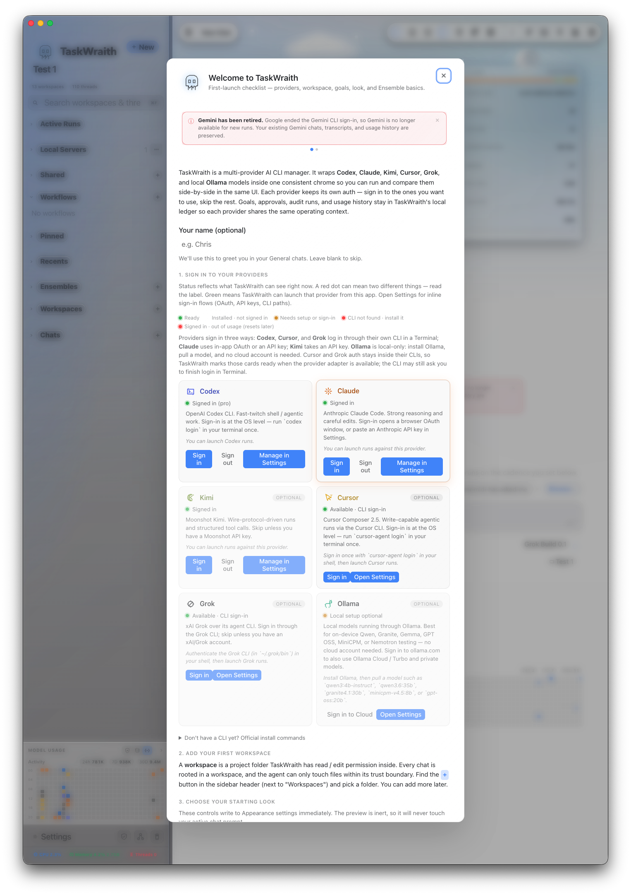
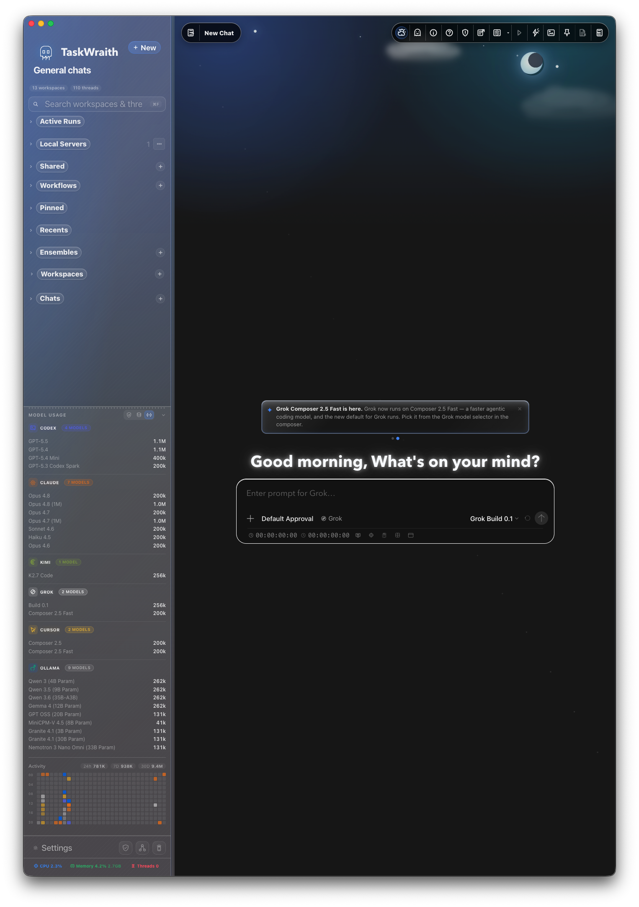
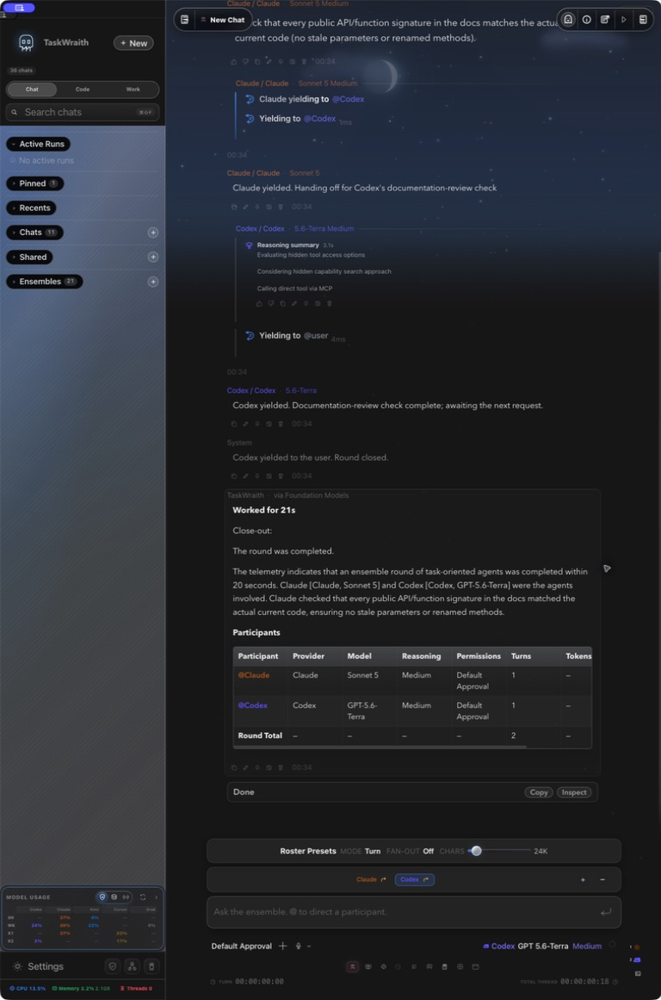
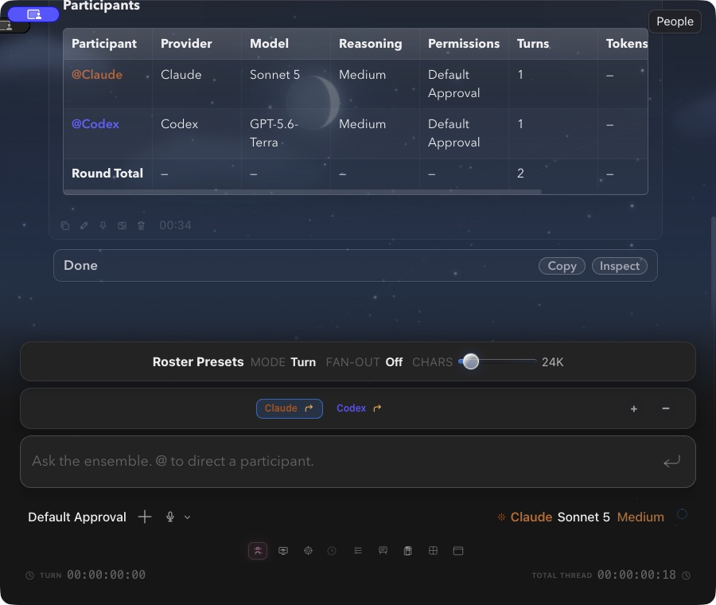
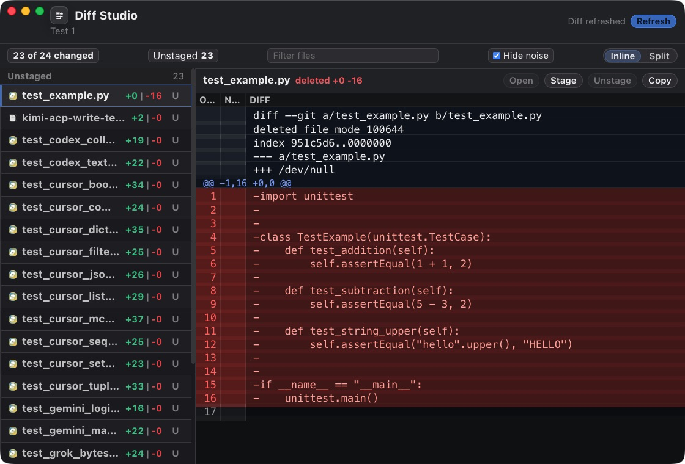
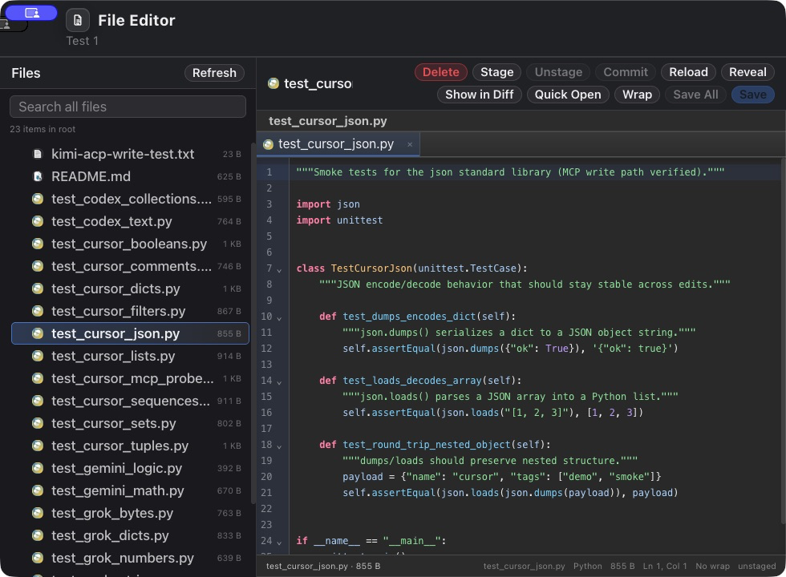

# TaskWraith

<p align="center">
  
</p>

[](https://github.com/boggspa/TaskWraith/actions/workflows/ci.yml)


TaskWraith is a local-first desktop workbench for running and reviewing AI coding
agents against developer workspaces. Its Electron app ships for macOS, Windows,
and Linux; macOS has the deepest native integrations and hosts the optional iOS
companion. TaskWraith keeps its orchestration, local history, and workspace
authority on the user's machine; prompts and run context still go to whichever
cloud provider the user selects.

Read [POSITIONING.md](POSITIONING.md) for the concise product promise, claim
boundaries, topology decision guide, and recommended small Ensemble panels.

> **iOS companion status:** TaskWraith for iPhone/iPad is in **TestFlight beta**.
> It is a **Mac companion** — it pairs with TaskWraith on macOS over an
> end-to-end-encrypted connection to monitor runs, approve actions, and reply
> from the phone; it is not a standalone AI app. Remote actions are governed by
> the Mac's universal per-workspace remote-access grants and each thread's
> independent approval policy. A workspace grant applies to every provider the
> Mac currently admits; it does not elevate any thread's permission preset.
> Relay/APNs infrastructure
> may see routing/status metadata (including aggregate added/deleted line
> counts), not plaintext prompts, commands, diff contents or hunks, or model
> output. Live Activities are the explicit exception to the ordinary encrypted
> task projection: ActivityKit must decode their push state, so Apple receives
> only an allowlisted coarse phase, provider names, start time, change counts,
> bounded seat states, layout/palette, and an opaque per-card reference—never
> task text, titles, paths, workspace/repository names, or run/chat ids. No
> privacy-sensitive value may ever be seeded into that state; expanding the
> allowlist requires a fresh privacy and security review. Testers can also build
> it from this repository with their own Apple Developer team. Push
> notifications are opt-in after pairing and require APNs credentials on the
> Mac (see
> `ios/TaskWraithApp/README.md`).

## Ensemble Threads

TaskWraith's most experimental surface is **Ensemble Threads**: shared work
sessions where multiple AI agents participate in the same conversation instead
of living in separate tabs. A thread can include up to fifty named participants
across Codex, Claude, AntiGravity, Kimi, Cursor, Grok, Pi, Mistral Vibe, and
local Ollama, each with its own model, role, order, and permission posture.

Kimi seats additionally require runtime admission: structural checks (stable
binary identity, bounded probes, the ACP-only posture) that are always
enabled, packaged builds included. While the reviewed qualification roster is
empty, admitted runs are labelled `unattested-development`; that labelling
cannot qualify a release.

**Cursor** is in the user-approved live set. Its current Path-B route signs in
with `cursor-agent` and works in solo chats, Ensembles, and delegated work.
Cursor can use its native tools alongside TaskWraith tools, with the selected
permission posture and workspace Tool Grants applying wherever TaskWraith
mediates. The provider-native boundary is explained in
[Trust & Safety](TRUST_AND_SAFETY.md).

This is not just provider switching. Ensemble participants see the same
transcript, can build on each other's work, hand off deliberately, run
turn-bound or continuous rounds, and fan out in parallel. Qualified tool-capable
participants can use TaskWraith's workspace tools under the same local approval
and audit model. In practice, a
single thread can hold a planner, implementer, adversarial reviewer, docs writer,
and local-model scout without losing the workspace timeline or review trail.

Ensembles are designed for work that benefits from disagreement and role
separation: code review, architecture critique, bug hunts, migration planning,
release checks, and "one agent implements while another watches the diff" flows.
They pair with Multiview, Workflows, slash commands, MCP tools, and the activity
viewport so multi-agent work remains inspectable rather than becoming a hidden
background process.

Normal top-level chats no longer need to be recreated just to change shape.
You can now switch provider, model, and reasoning on an existing single-provider
thread after it has history, and if a turn is already running those changes queue
and apply at turn end. Top-level idle chats can also flip in place between
single-provider and Ensemble mode on the same thread, preserving transcript
history; the ensemble toggle stays disabled until the current turn finishes.

## Trust, Safety, and First Runs

<table>
  <tr>
    <td width="76" align="center" valign="middle">
      
    </td>
    <td valign="middle">
      <strong>Start with low-risk work.</strong><br />
      TaskWraith is designed to keep permissions visible and auditable, but it
      still coordinates powerful local tools. Use a scratch repo and read-only
      posture first, then widen trust only after the behavior is familiar.
    </td>
  </tr>
</table>

TaskWraith has a broad optional permissions surface: provider CLIs, local models,
workspace file tools, shell/git actions, iOS remote control, collaborator
sharing, Screen Watch, Canvas/browser-like tools, media tools, and creative-app
automation. The default expectation is explicit user control: select a workspace,
choose a run posture, review approvals, inspect activity, and check diffs before
committing generated work.

New users should start with a scratch repository in Ask or Plan
workflow. Plan workflow is not general write access: it can save a narrow
markdown plan artifact under a validated workspace path for the proposed-plan
handoff, but ordinary file edits, shell commands, and tool writes still require a
higher permission posture or explicit approval. Do not enable remote pairing,
Screen Watch, Canvas/browser automation, creative app bridges, unattended
workflow grants, or full-workspace/yolo permissions until the app has earned
trust through several low-risk sessions.

Read [TRUST_AND_SAFETY.md](TRUST_AND_SAFETY.md) for the safe-first-run guide,
capability matrix, storage locations, provider data boundaries, release
verification steps, and known limits. Optional features that require outside
accounts, local services, or macOS permissions are covered in
[ADVANCED_OPTIONAL_SETUP.md](ADVANCED_OPTIONAL_SETUP.md). [SAFETY.md](SAFETY.md)
and [SECURITY.md](SECURITY.md) contain the engineering guardrails and release
baseline.

Electron builds configured with TaskWraith's first-party activity endpoint
leave privacy-minimised product observation off until you affirmatively choose
**Share** during first launch or under **Settings → Safety & Privacy**. The
choice is optional, sends only the fixed no-content contract, can be withdrawn
at any time, and never affects app features. Builds without an endpoint send
nothing. [PRIVACY.md](PRIVACY.md) explains platform aggregates, retention,
user choices, and the exact data boundary.

<table>
  <tr>
    <td align="center" valign="top" width="33%">
      <br />
      <sub><b>Welcome &amp; provider setup</b></sub>
    </td>
    <td align="center" valign="top" width="33%">
      <br />
      <sub><b>General App Layout</b></sub>
    </td>
    <td align="center" valign="top" width="33%">
      <br />
      <sub><b>A live Ensemble run</b></sub>
    </td>
  </tr>
  <tr>
    <td align="center" valign="top" width="33%">
      <br />
      <sub><b>Pop-Out Chat</b></sub>
    </td>
    <td align="center" valign="top" width="33%">
      <br />
      <sub><b>Diff Studio</b></sub>
    </td>
    <td align="center" valign="top" width="33%">
      <br />
      <sub><b>File Editor</b></sub>
    </td>
  </tr>
</table>


## Features

- **Workspace Safety**: Workspace selection, trust-state visibility, approval
  modes, and run-scoped safety state before agents operate on local files.
- **Provider Runs**: Integrated run surfaces for Codex, Claude, AntiGravity
  (bring-your-own Gemini API key), Kimi, Cursor, Grok, Pi, Mistral Vibe, and
  **local Ollama** (curated Qwen, Gemma, GPT-OSS, and Poolside presets).
  Kimi's integrated surface is admission-dependent: every build applies
  structural identity, bounded-probe, and ACP-posture checks. The current
  source-ahead reviewed roster is empty, so structurally admitted runs are
  labelled `unattested-development`; credentials or a visible picker row alone
  do not bypass structural admission.
  Cursor's current Path-B route signs in normally and works in solo chats,
  Ensembles, and delegated runs with native tools plus TaskWraith tools. The
  historical standalone Gemini provider remains readable but retired for new
  runs; it is distinct from the live, opt-in AntiGravity integration.
  Run management is provider-neutral: the lifecycle inventory covers all ten
  stable provider identities and every admitted turn crosses the shared signed
  posture boundary. Availability remains a separate product decision; missing
  broker, provenance, or scheduled-seal evidence is reported as a limited or
  unsealed run and does not by itself remove a provider.
  Provider names describe compatible integrations only — CLIs and accounts stay
  user-installed. See the [Model Catalogue](MODEL_CATALOGUE.md)
  for the curated model rows, reasoning controls, and Fast-tier semantics.
- **Multiview and Workflows**: Split the workbench into live panes, and run
  Workflows as first-class chat/run objects with scheduled recovery, dedicated
  sidebar space, and optional ensemble execution where enabled.
- **Thread-isolated Worktrees**: Selection-required runtime profiles allocate
  and persist a per-thread worktree before dispatch, then route the run and
  Diff Studio review through that effective workspace instead of the base
  checkout.
- **Chat / Code / Work navigation**: Use **Chat** for general conversations,
  **Code** for workspace-scoped threads, workflows, boards, and local servers,
  and **Work** for Projects. Projects build cross-workspace folder trees with
  customizable icons and hues, plus drag-and-drop and add-menu organization.
  Each project can designate, open, or start a Project Home thread, and keep a
  library of relevant files, folders, and links. Project integration now includes
  discover→review→import flows, consentful Extracts, Ensemble Use-next integration,
  Studio-lite keepables, and inline citation `⟦pref:…⟧` chips.
- **Thread Goals**: Set a persistent objective with `/goal <objective>` or the
  composer goal control. Codex uses native goal state when the installed runtime
  exposes it; qualified tool-capable providers get a TaskWraith-managed fallback
  with explicit complete/blocked lifecycle tools.
- **Composer Shells**: Provider-aware and task-oriented composer variants give
  each working mode its own affordances—including the ChatGPT shell—without
  changing the safety model. See [COMPOSER_VARIANTS.md](COMPOSER_VARIANTS.md)
  for the Electron shell gallery.
- **Plan Workflow**: Plan runs keep the provider in a read-only execution
  posture while allowing a product-managed markdown plan file to be written under
  validated workspace paths. Ask runs do not get that artifact-write
  carve-out.
- **Ensemble Threads**: Multi-agent shared work sessions with named provider
  participants, role/order control, turn-bound or continuous orchestration,
  optional parallel fan-out, cross-provider handoffs, a shared Blackboard for
  cross-agent notes and rich polls (composer quick-access popover plus full
  management in the Notes pane), and TaskWraith MCP tools shared among qualified
  tool-capable seats under one auditable workspace policy.
- **Agent Pool**: Save reusable agents in Settings, each with a linked
  provider/model/reasoning configuration and running contribution stats (runs,
  threads, tokens, tool calls, work time), then drag them into ensemble rosters.
  A welcome-dashboard leaderboard ranks pool agents by contribution.
- **Audit Runs**: `/audit` can coordinate provider-backed review passes with
  live progress, structured findings, verdicts, and dismissible run banners.
- **Local Ollama**: Full TaskWraith tool-surface parity where local capability is
  available, optional live web search/fetch, per-model context engineering, and
  session memory across runs — all governed by the same permission roles and
  policy gates as cloud providers.
- **Custom MCP Servers**: User-defined MCP servers can be managed, validated,
  imported, exported, and attached to compatible provider runtimes with
  provider-specific JSON/TOML snippets and readiness checks. Cursor JSON
  import/export remains useful for configuration interchange. Managed Cursor
  can use both its native tools and TaskWraith's governed tools; provider- or
  account-owned MCP remains a separate trust boundary.
- **Activity Review**: Live activity viewport for in-flight tools and thinking,
  compact timelines, durations, and raw event inspection.
- **AI Close-Out Summaries**: Run and ensemble-round close-out cards show
  readable prose plus a pass/fail line instead of quoting an agent's last
  message verbatim. On Macs with Apple Foundation Models available, that prose is
  generated on-device (badged "via Foundation Models") behind a prompt-injection
  guard; a deterministic summary is the fallback everywhere else.
- **Diff Studio**: File-list and diff-detail review for run-scoped changes and
  current workspace changes, including previews for newly created text files.
- **GitHub PR & CI Awareness**: When the workspace has a GitHub remote, an icon
  row above the composer shows live PR lifecycle and CI status; hovering opens a
  popover with fuller detail (including failing-check logs). A per-chat
  **Watch this PR** opt-in can post deduplicated status transitions after
  revalidating the current PR head, while **Notify thread** remains available
  for an immediate Blackboard or transcript post.
- **Local History and Usage**: Local-only chat, run, usage, approval-ledger, and
  audit state for repeat work without a hosted backend.
- **iOS Companion**: TestFlight companion surfaces Demo Mode, Workflows,
  first-launch/provider readiness, usage snapshots, approvals, questions,
  transcript streaming, thread renaming, inline images, remote file/diff
  inspection, home search and pin/rename/archive, scheduled sending, and
  transcript export. Source-ahead builds also offer configurable completion
  banner presets and Live Activities for in-flight runs on the Lock Screen and
  Dynamic Island, with the separately disclosed coarse APNs state above.
- **Release Tooling**: Security, dependency, packaging, and signing hooks for
  reproducible local release work.

Download installers from the
[latest GitHub Release](https://github.com/boggspa/TaskWraith/releases/latest)
(see [Try a packaged build](#try-a-packaged-build)). See
[CHANGELOG.md](CHANGELOG.md) for release notes. This checkout may contain
repository work newer than the latest tag; the changelog's top **source-ahead**
entry describes those changes only. They are not shipped until a new tag and
matching artifacts are published.

## Managed Enterprise Boundary

TaskWraith has local safety controls, local audit evidence, redacted export
surfaces, and partial managed-policy support. It does not currently claim SSO,
SCIM, SIEM integration, WORM or append-only audit export, organization-wide
retention, or a complete MDM/enterprise control plane. Treat enterprise-readiness
notes as claim boundaries and implementation tracking, not a compliance
attestation.

## Public Source Boundary

TaskWraith source code is licensed under Apache-2.0. Provider product names are
used nominatively to describe interoperability with user-installed tools and
accounts. A narrowly scoped set of first-party provider PNG marks is bundled
for factual identity labels; provenance and source-specific rights notes live
in [`design-assets/provider-logos`](design-assets/provider-logos/). Those marks
remain the property of their respective owners and do not imply endorsement.
The repository does not intentionally bundle API credentials, signing material,
or proprietary provider fonts.

Users are responsible for installing and authenticating the provider CLIs, SDKs,
or accounts they choose to use. TaskWraith does not bypass provider authentication,
quotas, rate limits, approval flows, or terms of service.

## Built with AI Agents

TaskWraith is developed the way it is meant to be used — with AI coding agents in
the loop. Day-to-day work pairs **OpenAI Codex** and **Anthropic Claude**:
planning, implementation, multi-agent review passes, and large refactors run
through the agents. Agent output is reviewed by a human before merge, and release
work is gated by dependency checks, typecheck, tests, native bridge tests on
macOS, packaged-app smoke tests, signing/notarization validation where
credentials are available, and secret-bundle guards. Commits carry
`Co-Authored-By` trailers for the agents that contributed.

## Try a packaged build

If you want to run TaskWraith without building from source, use the installers
on the
[**latest GitHub Release**](https://github.com/boggspa/TaskWraith/releases/latest).

Verified artifacts on each release (names match the uploaded files exactly, with
`<version>` standing in for that release's version):

| Platform | Artifact |
| --- | --- |
| macOS (Apple Silicon + Intel, universal) | `TaskWraith-<version>-universal-mac.dmg` (also `.zip`) |
| Windows x64 | `TaskWraith-<version>-win-x64-setup.exe` |
| Windows arm64 | `TaskWraith-<version>-win-arm64-setup.exe` |
| Linux | `TaskWraith-<version>.AppImage` or `taskwraith_<version>_amd64.deb` |

Checksums for those files are listed in `SHA256SUMS-<version>.txt` on the same
release page. Prefer the checksum-listed filenames over similarly named CI or
side-channel builds.

**After install.** On first launch, TaskWraith opens a short **Welcome** sheet
covering providers, adding a workspace, appearance, permission posture, usage,
Ensemble basics, and power-user shortcuts. It shows once (dismissal is stored
locally); reopen it anytime with the `?` help pill in the main pane. That sheet
is onboarding only — the empty-chat starter cards are a separate surface.

**Providers still need their own setup.** Packaged TaskWraith does not install
provider CLIs or accounts for you. Claude can sign in from Settings; Codex,
Cursor, Grok, and most other seats need the matching CLI installed and a
terminal login first. Ollama is local (install Ollama, then `ollama pull` a
model) and does not require a cloud account for local runs. Start with a
scratch repo and a read-only posture — see [Trust, Safety, and First
Runs](#trust-safety-and-first-runs) and [TRUST_AND_SAFETY.md](TRUST_AND_SAFETY.md).

## Development Setup

For contributors building from this repository:

1. Install Node.js 20 or newer.
2. Install any provider CLI you intend to use separately.
3. Run `npm ci`.
4. Run `npm run dev`.

Use `npm ci` for clean installs so npm follows the committed lockfile exactly.
Run `npm run security:deps` before release work or after dependency changes.

## Discord Context

Discord Context is optional and read-only: it attaches recent messages from
bot-accessible channels as untrusted context and does not post back to Discord.
Setup requires a Discord bot token, at least one guild/server ID, and channel
read permissions; see
[Advanced Optional Setup - Discord Context](ADVANCED_OPTIONAL_SETUP.md#discord-context)
for the environment variables and packaged-app config path.

## Useful Commands

```sh
npm run security:deps
npm run typecheck
npm run test
npm run test:swift:bridge   # macOS only — see note below
npm run validate:release    # release-readiness wrapper; see note below
npm run build
```

`npm run test:swift:bridge` runs the native macOS bridge daemon's Swift test
suite in `swift/TaskWraithBridge`. The bridge gates native macOS actions
(Screen Watch, creative-app, and editor helpers), so its tests run
automatically in two places: the macOS legs of CI, and the `build:mac` /
`build:mac:notarized` release recipes (as a pre-flight gate, so a release
build fails fast on a bridge regression). It requires macOS with the Xcode
Swift toolchain and is not part of the cross-platform `npm run ci`.

`npm run validate:release` is the broad local release-readiness wrapper. It runs
the TypeScript gates, dependency/security checks, tests, package smoke checks,
platform-specific packaging validation (`build:unpack` on macOS, `build:win:nopublish`
on Windows, `build:linux:nopublish` on Linux), and the bundled-secret guard. It is
not a substitute for a credentialed notarized release build, update-feed
validation, SBOM generation, or platform-specific artifact signing.

## Project Layout

- `src/main`: Electron main process, provider orchestration, persistence, and
  workspace safety services.
- `src/preload`: Narrow IPC bridge exposed to the renderer.
- `src/renderer`: React UI, provider review surfaces, settings, and visual
  system.
- `swift`: macOS bridge daemon sources used by local release builds.
- `scripts`: Build, security, validation, signing, and packaging utilities.

See `CHANGELOG.md` for release history, and `TRUST_AND_SAFETY.md`,
`ADVANCED_OPTIONAL_SETUP.md`, `SESSION_AND_WORKSPACE.md`, `THREAD_INTROSPECTION.md`,
`COMPOSER_VARIANTS.md`, `ARCHITECTURE.md`, `SAFETY.md`, `SECURITY.md`, and
`PRIVACY.md`, and `TERMS_NOTES.md` for more detail.
