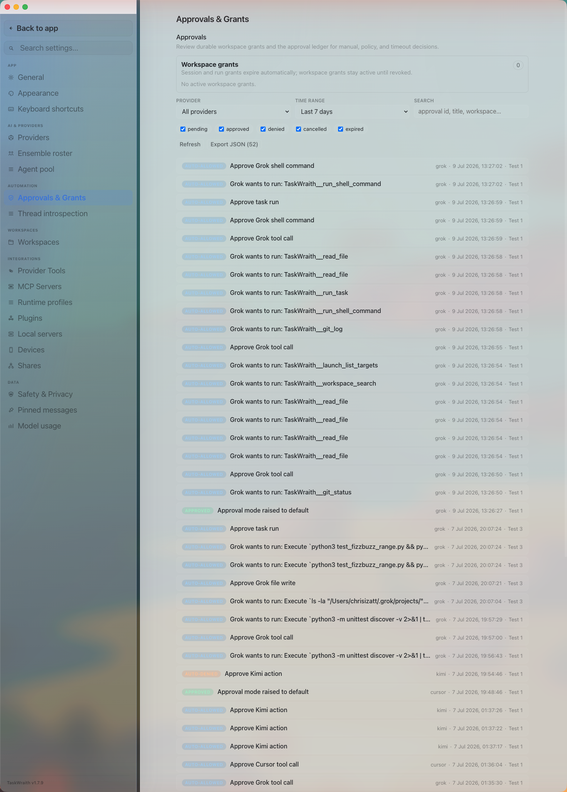

# How to: Approval Ledger

**Platform:** Electron

## What it is
The Approval Ledger is an audit log of every approval decision TaskWraith has recorded — manual accept/decline, auto-allow by policy, and auto-deny by timeout — across all providers and chats. It also lists durable workspace grants you've issued and lets you revoke them.

## Where to find it
**Settings → Automation → Approvals & Grants.**

## How to use it
1. Open **Settings → Automation → Approvals & Grants** to see the **Workspace grants** list at the top — durable grants that stay active until revoked (session and per-run grants expire automatically and aren't listed here).
2. Click **Revoke** on a workspace grant to remove it, or use **Forget all sub-thread delegations for this workspace** to bulk-revoke delegation grants tied to the workspace you're currently viewing.
3. Filter the ledger below by **provider**, **time range** (last 24 hours / 7 days / 30 days / all time), or the status chips (pending, approved, denied, cancelled, expired), and use the search box to match an approval id, title, or workspace.
4. Click a row to expand it and see details: method, service, decision, decision source, granted scope, any attached note, timestamps, run/chat ids, and the retained request preview or metadata. Signed-elevated `canvas_eval` is deliberately content-minimised: its exact script exists only in the transient desktop approval, while the durable row retains an approval-bound digest/length receipt rather than the script or returned value/error.
5. Click **Refresh** to pull the latest decisions, or **Export JSON** to download the currently-filtered records for sharing or forensics. Treat the export as sensitive: ordinary approval rows can include request bodies, command previews, file paths, prompt snippets, metadata, decision notes, and workspace identifiers. The `canvas_eval` durable redaction above remains in force for exports.

## Remote-device audit records
The iOS companion bridge keeps its own remote-device audit path for paired-device actions and trust decisions. The companion is currently a TestFlight beta, not a generally distributed App Store release. Remote authority stays gated by end-to-end-encrypted pairing, per-workspace allowlists, granted capabilities and approval modes, and host-side policy. You can disable the bridge in **Settings → Devices**; `IOS_REMOTE_TRUE=0` or `IOS_REMOTE_TRUE=false` is the emergency force-off and prevents the bridge from starting at all.

## Release check
Before a release, verify:

- approval ledger tests pass
- remote-device audit ledger tests pass when remote/iOS code changes
- Settings → Automation → Approvals & Grants still loads and exports records
- `/audit` completion and failure states are visible, dismissible, and durable
- release notes call out any new policy or grant behavior

## Tips & related
- [Pending Approval Modal](pending-approval-modal.md) — where the original accept/decline decisions are made.
- [Permission Elevation Sheet](permission-elevation-sheet.md) — prompts for raising approval posture, also recorded here.
- [Provider Agentic Policies](provider-agentic-policies.md) — the per-provider policies that drive auto-allow/auto-deny decisions.
- [Approvals Popover](../footer-control-row/approvals-popover.md) — sidebar footer queue that deep-links into this same panel.
