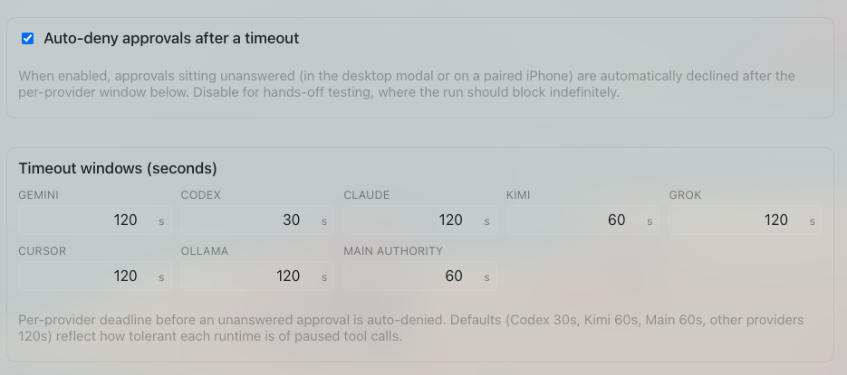

# How to: Approval Timeouts

**Platform:** Electron

## What it is
Approval timeouts auto-decline a pending approval request if nobody responds in time, so an agent run can't hang forever waiting for input. Each provider gets its own timeout window, since some agents (Codex's sandbox commands) stall faster than others (Claude's longer think-time).

## Where to find it
Settings → **App → General → Timeout windows**.

## How to use it
1. Open **Settings → App → General**, then check **Auto-deny approvals after a timeout** under **Timeout windows**.
2. Set a window (in seconds, 5–3600) for each tunable field: **Codex**, **Claude**, **Kimi**, and **Main authority** (the longer window used for workspace-trust and similar non-provider approvals). One extra field for a retired provider still appears in this grid but has no effect on live runs.
3. Leave the toggle off if you want approvals to block indefinitely instead — useful for hands-off testing.
4. When a timeout is armed, the pending approval in the composer shows a live "Auto-denies in …" countdown; if it reaches zero before you respond, the request is automatically declined.

## Tips & related
- [Pending Approval Modal](pending-approval-modal.md) — where the countdown and Accept/Decline choices actually appear.
- [Approval Ledger](approval-ledger.md) — review past decisions, including ones that were auto-denied by timeout.
- [Provider Agentic Policies](provider-agentic-policies.md) — controls which actions require approval in the first place.
