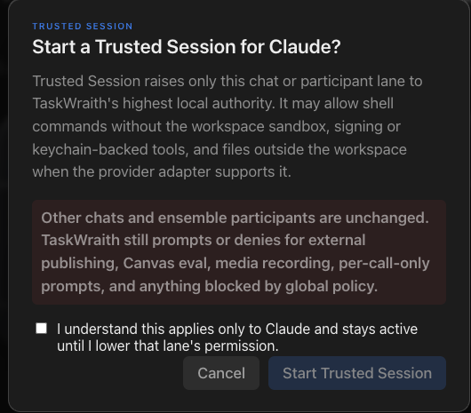

# How to: Permission Elevation Sheet

**Platform:** Electron

## What it is
The permission elevation sheet is a confirmation dialog shown when you **raise** a permission preset — in a solo chat, a side chat, or for the selected ensemble participant. Raising warns before anything changes; lowering never does. There are two warning tiers, plus a dedicated sheet for Trusted Session:

- **Raising to Default Approval** — a small notice ("Let *provider* edit files in this workspace?") shown **once per workspace and provider**. After you continue once, later raises to Default Approval for that workspace + provider apply without asking again.
- **Raising to Workspace Write** — a sterner sheet shown **every time**, with an "I understand the risks" checkbox that must be ticked before the **Enable Workspace Write** button unlocks.
- **Raising to Trusted Session** — a dedicated **Start a Trusted Session?** sheet with its own risk acknowledgement, since that preset grants TaskWraith's highest local authority (host-level tools where the provider supports them).

## Where to find it
Appears automatically over the current chat when you raise the **permissions chip** in the composer or the side-chat composer. In an Ensemble chat, select a participant in the chip strip first — raising that participant's preset warns the same way and applies only to that lane. Moving **down** the ladder (for example Workspace Write → Read-Only/Recon) always applies immediately with no confirmation.

## How to use it
1. Open the **permissions chip** in the composer and pick a higher preset.
2. Read the warning. For **Workspace Write** it explains the agent can create, edit, run, and delete workspace files **without approving each action**, and that the preset stays workspace-scoped. For **Trusted Session** it also covers host-level shell authority and what stays protected (external publishing, Canvas eval, media recording, and globally blocked actions still prompt or deny).
3. For Workspace Write and Trusted Session, tick the risk acknowledgement checkbox — the confirm button stays disabled until you do. The Default Approval notice needs no checkbox.
4. Click the confirm button (**Continue**, **Enable Workspace Write**, or **Start Trusted Session**) to apply the change, or **Cancel** (or press Esc) to stay at the current, safer preset. Nothing changes until you confirm — the chip keeps its old value while the sheet is open.
5. You can lower the preset again at any time from the same chip — no warning is shown when lowering.

For source-ahead Cursor, an elevated selection cannot launch a run. TaskWraith
starts no managed Cursor process; both Plan and tool modes are
unavailable/unqualified.

## Tips & related
- The once-per-workspace memory applies only to the Default Approval notice; Workspace Write and Trusted Session ask every time by design.
- In an Ensemble chat, the confirmation covers only the selected participant — other participants keep their own presets.
- [Provider, Model, and Permissions Pickers](../composer/provider-model-permissions-pickers.md) — the composer chip that triggers this sheet.
- [Pending Approval Modal](pending-approval-modal.md) — the per-action approval prompt you still see for individual gated actions even after elevating.
- [Approval Ledger](approval-ledger.md) — audit history that records permission elevation decisions.
- [Provider Agentic Policies](provider-agentic-policies.md) — controls which services and actions require approval in the first place.
