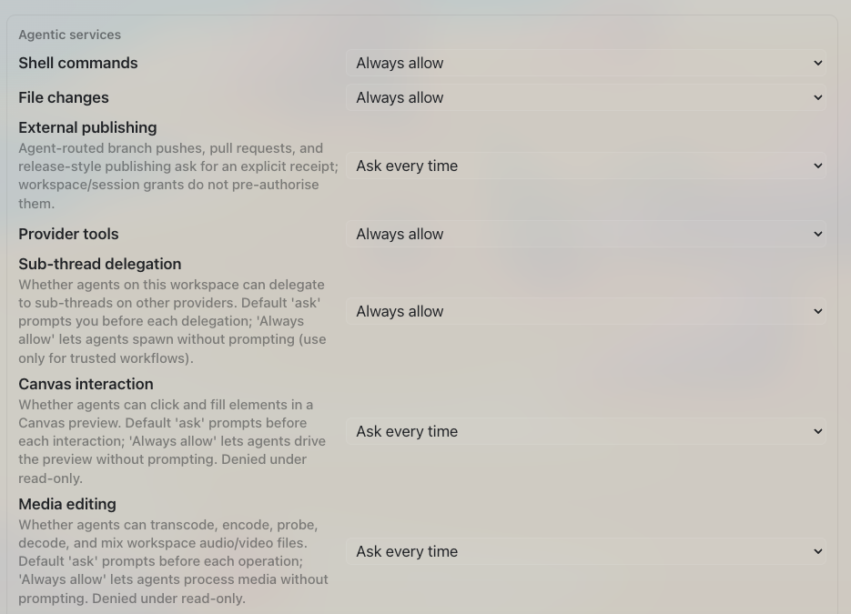

# How to: Provider Agentic Policies

**Platform:** Electron

## What it is
Agentic services are the global policy switches that decide whether an agent's shell commands, file edits, provider tools, sub-thread delegation, canvas interaction, media editing, and network access run automatically, ask you first, or are blocked outright.

These rows are policy ceilings, not promises. A provider can offer
less than the selected policy allows. Managed Cursor can use
TaskWraith's governed tools alongside its native tools: the policy applies to
calls made through TaskWraith, while native Cursor actions remain provider-owned.

## Where to find it
**Settings → AI & Providers → Providers → Agentic services.** A read-only summary ("Policy posture") also appears on **Settings → Data → Safety & Privacy**, with an **Edit policies** button that jumps back here.

## How to use it
1. Open **Settings → AI & Providers → Providers** and scroll to the **Agentic services** group.
2. For each service — **Shell commands**, **File changes**, **Provider tools**, **Sub-thread delegation**, **Canvas interaction**, **Media editing**, **Network access** — pick a policy from its dropdown: **Ask, then allow workspace** (prompt once, then auto-allow for that workspace), **Ask every time**, **Always allow**, or **Block**. Network access only offers **Allow** or **Block**.
3. Leave **Media recording** as is — it's denied and disabled (microphone/camera capture isn't shipped yet).
4. Check the grant count hint below the list to see how many durable workspace permissions are currently saved; manage or revoke them from the Approval Ledger.
5. To review all your policies at once instead of editing them, go to **Settings → Data → Safety & Privacy** — it flags "Always allow" rows as risk and "Ask, then allow workspace" rows as watch items, and links to **Edit policies** to come back here.

## Tips & related
- [Approval Ledger](approval-ledger.md) — review past decisions and revoke saved workspace grants.
- [Pending Approval Modal](pending-approval-modal.md) — where "Ask every time" prompts actually appear during a run.
- [Approval Timeouts](approval-timeouts.md) — configure auto-deny countdowns for prompts these policies trigger.
- [Providers tab](../settings-and-configuration/providers-tab.md) — the full Providers settings page this matrix lives on.
- [Safety and privacy tab](../settings-and-configuration/safety-and-privacy-tab.md) — read-only overview of your policies with a deep-link back here.
