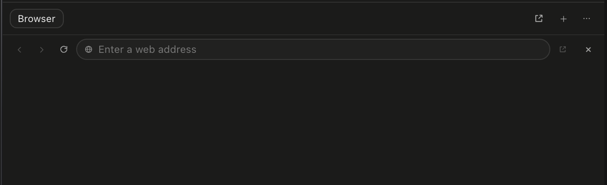

# How to: Canvas Browser

**Platform:** Electron

## What it is

Canvas Browser is TaskWraith's built-in web browser in the current task's right dock. It gives you and the active agent the same visible page, address bar, history, and tabs, so an agent can research the web or walk through a local app without taking the result away from the chat.

Browser tabs belong to the task, while sign-ins and site data live in one TaskWraith browser profile on your device. The profile survives restarts, but it is separate from Safari, Chrome, and your provider sign-ins.

## Where to find it

Open the right dock and select **Canvas**, or ask the agent to browse. A navigation request opens Canvas automatically in the active task when no browser tab is already open.

The empty Canvas starts with a quiet **New tab** view. Use **+** to switch between Browser, Sketch Canvas, Mesh Canvas, and Simulator Canvas. Use **…** for browser profile and privacy controls. The placement button moves the current surface into its own window without reloading a live Browser or Sketch tab.

The Canvas window uses the same tab strip and surface picker as the dock. Choose **Dock** in the window header to move that window's live Browser and Sketch tabs back into the owning task. Mesh Canvas, Simulator Canvas, and Media Viewer follow the same pop-out and Dock pattern.

## Browse with an agent

1. Choose **Accept Edits**, **Full WS Access**, or **Full Access** in the composer.
2. Ask naturally, for example: “Go on Google and search for Cambridge weather, then open the BBC local forecast.”
3. The agent opens Canvas in this task, navigates, and clicks or types into ordinary form fields. The final page stays open for you.
4. If a site asks for a password, passkey, or verification code, take over the Canvas and complete that step yourself — agents cannot fill in sign-in fields.
5. Tell the agent to continue after sign-in. It can use the resulting signed-in page, subject to the same browser controls and your instructions.

At **Accept Edits** and higher, ordinary navigation, clicks, and typing run without asking every time. At Ask and Plan, each browsing action asks for approval first.

**One exception overrides your settings:** a click on something the page marks destructive or financial always stops for a single confirmation — "Allow one consequential action?" — even at Full Access. Declining refuses that one action rather than ending the run.

## Sign-ins and credentials

- TaskWraith keeps the Canvas Browser's cookies and site data between app launches.
- The profile belongs to TaskWraith on this device; it does not import Safari, Chrome, password-manager, or provider credentials.
- Agents cannot type into password, one-time-code, or other sign-in fields.
- When you interact with the page, the agent steps aside rather than competing with your input.

## Clear the browser profile

1. Open **Canvas** in the right dock.
2. Select **…** to open **TaskWraith Browser** profile controls.
3. Choose **Clear browsing data…**, review the scope, then select **Clear data**.

The reset closes browser tabs across all tasks before clearing cookies, sign-ins, site data, and cache. Sketch, Mesh, Simulator, rendered HTML, image, and device canvases are kept. The reset is human-only; agents cannot trigger it.

## Browser boundaries

- Canvas opens HTTP and HTTPS pages. Link-local and cloud-metadata addresses stay blocked, and private-network hosts need the existing allowlist.
- Downloads and website permission prompts are blocked.
- Pages that request a new window stay inside the Canvas Browser.
- Use the address-bar controls to go back, forward, reload, stop, or open the current page in your default browser.
- Closing a Canvas window closes its window-owned live Browser and Sketch tabs. Choosing **Dock** moves them back instead.

## Tips and related guides

- [Canvas composer button](./canvas-composer-button.md) — open a blank browser canvas in the right dock, then type the address in its own bar.
- [Canvas multiview pane](./canvas-multiview-pane.md) — embed a live web preview in a split workspace pane.
- [Mesh Canvas](./mesh-canvas.md) — inspect and author chat-owned 3D scenes.
- [iOS canvas preview](./ios-canvas-preview.md) — preview Canvas content on the companion.
