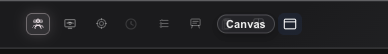

# How to: Canvas composer button

**Platform:** Electron

## What it is
The Canvas composer button is a one-click way to open Browser, Sketch, Mesh, Simulator, or Homebrew Emulator Canvas for the current task. It starts in the right dock, where the surface can then move into a standalone window without losing its Canvas chrome.

## Where to find it
It's an icon-only button in the composer's telemetry row (the footer icon cluster), next to the Multiview layout picker. Hovering or focusing it shows a "Web canvas" hint label; clicking it opens a small popover with a URL field.

## How to use it
1. Click the canvas icon in the composer's telemetry row to open the URL popover.
2. Choose Browser, Sketch Canvas, Mesh Canvas, Simulator Canvas, or Homebrew Emulator.
3. Browser opens a blank tab in the current task's Canvas dock; enter the local or HTTP(S) address in its address bar.
4. Use the placement button in the Canvas tab strip to move the surface into its own window. The window retains the same tabs, Browser navigation controls, and surface picker.
5. Choose **Dock** in the window header to return its live tabs or native surface to the task.
6. If a URL cannot be reached, Canvas shows the navigation error in its chrome so you can correct the address and retry.

## Tips & related
- [Canvas multiview pane](./canvas-multiview-pane.md) — embed a Canvas inside a split pane instead of a floating window.
- [Plus tools menu](../composer/plus-tools-menu.md) — other composer-row tools and pickers.
- [iOS canvas preview](./ios-canvas-preview.md) — the companion view for Canvas content on iOS.
