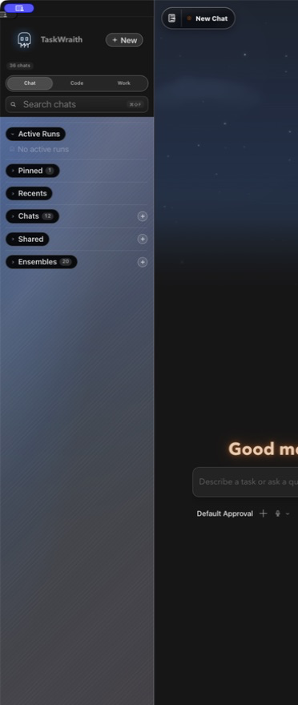

# How to: Chat Types

**Platform:** Electron

## What it is
TaskWraith supports General chats and workspace-scoped threads, either with one provider or as an Ensemble with multiple participants. It also supports scheduled Workflows, linked children — agent-delegated sub-threads and user-opened side chats — and Shared chats for human collaboration. A Project is an organizer rather than a separate chat type: it can group top-level chats and threads from either scope.

## Where to find it
Use the sidebar's **Chat** surface for General chats, **Code** for workspace-scoped threads and workspace tools, and **Work** for the **Projects** organizer. Pinned, Recents, Ensembles, and Shared sections are scoped to the active Chat or Code surface. Use **+ New** from Chat or Code to start work in that scope.

## How to use it
1. Choose **Chat** for a General chat or **Code** for a workspace thread, then click **+ New**. Code also exposes workspace Workflows and Workspace Boards.
2. To start an Ensemble, create a draft and enable **Ensemble** before the first send, use the **+** button in the Ensembles section, or convert an eligible idle top-level chat from the composer.
3. Ensembles appear in the Ensembles section for their Chat or Code scope; pinned and recently active ensembles can also appear in Pinned or Recents.
4. To branch off an existing chat without losing context, open a side chat from the message context menu, or let an agent delegate part of its work to a sub-thread — both appear nested under their parent chat and are limited to one level deep.
5. To collaborate with others, create a Shared chat from **+ New**, or use **Join Shared Chat** to follow one someone else shared with you; shared chats appear in the matching Chat or Code scope.
6. Switch to **Work** when you want to create nested Projects and group existing top-level chats or threads without changing their original scope.

## Tips & related
- [Sidebar sections](../sidebar-navigation/sidebar-sections.md) — how Chat, Code, Work, and their sections are organized.
- [Workspace and chat tree](../sidebar-navigation/workspace-and-chat-tree.md) — how chats nest under workspaces.
- [Create an Ensemble chat](../ensemble-mode/create-ensemble-chat.md) — running multiple agents in one chat.
- [Sub-thread delegation](sub-thread-delegation.md) and [Side chat](side-chat.md) — linked child chats branched off a parent.
- [Shares popover](../footer-control-row/shares-popover.md) — managing chats you've shared with others.
