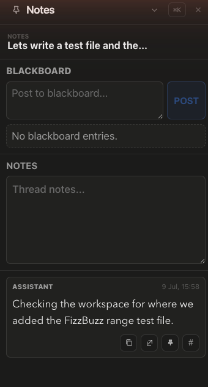

# How to: Pinned Messages

**Platform:** Electron

## What it is
Pinned Messages lets you mark important messages in a thread so they stay easy to find, alongside per-thread Notes and the Blackboard (an agent-maintained list of decisions, facts, risks, and reminders). A separate Settings page aggregates every pinned message across all your workspaces and chats in one place.

## Where to find it
Pin a message from its hover action chip or right-click context menu in any transcript. View pins for the current thread by clicking the **Notes** tab in the right dock rim (toolbar icon shows a pin count badge). View pins across every chat via **Settings → Pinned messages**.

## How to use it
1. Hover over a message (or right-click it) and choose **Pin message** to add it to the thread's pinned list; choose **Unpin message** to remove it.
2. Open the right dock and select the **Notes** tab to see the thread's Blackboard entries, a free-text Notes box, and the list of pinned messages.
3. From a pinned message card, use the toolbar icons to copy its content, jump back to it in the transcript, unpin it, or (if the chat belongs to a workspace) add it to the workspace board.
4. Open **Settings → Pinned messages** to browse pins grouped by workspace and chat across your whole app; use **Open** on any entry to jump straight to that message in its thread.

## Tips & related
- [Message context menu](../transcript-and-search/message-context-menu.md) — where the Pin/Unpin action lives alongside Copy, Side Chat, and Delete.
- [Right dock rim](../transcript-and-search/right-dock-rim.md) — the contextual Home/Chat/Run/Media/Notes/Files/Inspect/Term toolbar that the Notes panel belongs to.
- [Workspace Boards](../workflows-and-boards/workspace-boards.md) — pinned messages can be added directly to a board from their card.
- [Side Chat](side-chat.md) — another action available from the same message context menu.
