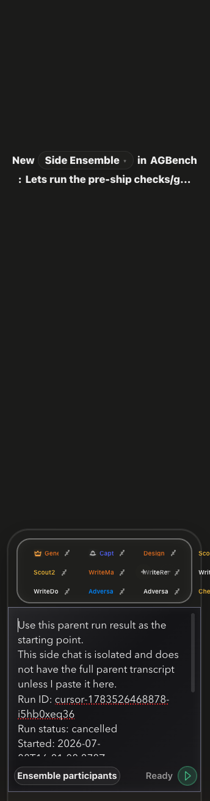

# How to: Side Chat

**Platform:** Electron

## What it is
A side chat is a linked sidecar chat that opens next to your current chat — either docked as a split pane, a right-hand drawer, or a separate pop-out window. It starts from a copied snapshot of the parent chat (or a clone of the parent ensemble, a delegated sub-thread, a guest participant, a fan-out of all participants, or a specific transcript message) so you can explore a tangent without disturbing the main transcript. Ending a side chat cancels its queued work and archives it.

## Where to find it
The split-pane button in the pane's corner controls is a plain toggle, not a menu: it reads **Open isolated side chat** when no sidecar is showing, and **Hide linked chat pane** once one is. Click it to open a sidecar beside the current chat with a copied parent snapshot.

The other presentations are slash commands rather than menu items — type them in the composer:
- `/side` — **Open isolated side chat**, the docked sidecar pane.
- `/side-drawer` — **Open isolated side drawer**, the same sidecar as a right-hand overlay.
- `/side-popout` — **Pop out linked chat**, the current linked chat in its own window.
- `/side-main` — **Open linked chat as main**, navigating the main pane to the linked chat.

You can also right-click (or use the context menu on) any message in the transcript and choose **Open side chat** to seed a new side chat from that message.

## How to use it
1. With a chat open, click the split-pane corner control (or run `/side`) to dock a sidecar pane; use `/side-drawer` instead for the right-hand overlay.
2. While the new sidecar is still empty, its welcome line reads "New **Side Chat** in …". Click that label to open the side-chat type picker and choose a different kind: in an ensemble chat the default becomes **Side Ensemble** (clones the ensemble's participants), and each of the parent's live sub-threads is offered as **Subagent Side Chat with …**. Side chats created as a fan-out are labelled **Fan-out side chat** wherever they are listed.
3. Work in the side chat like any other chat — it has its own composer and transcript.
4. Use the sidecar's header buttons to **Pop out linked chat**, **Open as main**, go **Back to parent**, or **Close side view** (which leaves the linked chat running).
5. When you're done, click the danger button to **End side chat**, which cancels queued work and archives it. In a popped-out side chat window, the same header also offers **Dock as split** and **Dock as drawer**.

## Tips & related
- [Sub-Thread Delegation](sub-thread-delegation.md) — delegate work to a new child agent instead of a linked sidecar.
- [Chat Types](chat-types.md) — overview of how side chats relate to other chat kinds.
- [Pinned Messages](pinned-messages.md) — pin a message before branching it into a side chat.
- [In-Chat Search](in-chat-search.md) — find the message you want to seed a side chat from.
