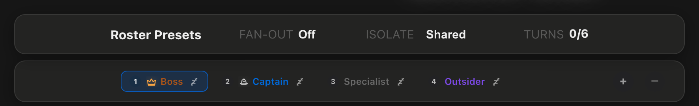

# How to: Ensemble Mode Picker

**Platform:** Electron

## What it is
The Ensemble Mode picker is the composer control that sets how participants take turns in an ensemble chat: **Turn** (each agent speaks once per round) or **Continuous** (agents can hand work back and forth across bounded continuation turns). A separate Off/Read/Write toggle labeled **Fan-Out** sits beside it for parallel work.

## Where to find it
In an **ensemble chat**, look at the **second row of the Roster Presets section** above the composer input (below the preset chips). The row groups four labeled controls: **Orchestration** (this picker, showing "Turn" or "Continuous"), **Fan-Out** (Off/Read/Write), **Shared History Budget** (a slider), and — in Continuous mode — **Turn Budget**. It appears on both the new-ensemble welcome screen and in-thread, once a chat is in ensemble mode.

## How to use it
1. Click the mode button (labeled with the current mode) to open the picker popover.
2. Choose **Turn** for strict round-robin, or **Continuous** to let agents hand off mid-round via `@mentions` or `ensemble_yield`.
3. Drag the **Shared History Budget** slider on the same row to control how many characters of recent panel history each participant receives.
4. Use the **Fan-Out: Off / Read / Write** buttons beside the picker to enable parallel fan-out for read-only (or, where unlocked, writer) participants.

## Tips & related
- [Create an Ensemble Chat](../ensemble-mode/create-ensemble-chat.md) — start an ensemble chat before this picker becomes available.
- [Fan-Out Toggle](../ensemble-mode/fan-out.md) — more on the Off/Read/Write toggle beside this picker.
- [Continuous Hops Meter](../ensemble-mode/continuous-hops-meter.md) — tracks remaining handoffs when using Continuous mode.
- [Participant Chip Strip](../ensemble-mode/participant-chip-strip.md) — manage who's in the round above the composer.
