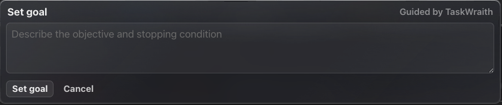

# How to: Goal Button

**Platform:** Electron

## What it is
Sets a goal for the chat — what you want done and when it counts as finished. The agent keeps working toward it until you pause, block, or complete it.

## Where to find it
On the composer's telemetry row, the icon row under the prompt box, next to the schedule clock. Click the target icon.

## How to use it
1. Click the **Goal** button. It stays greyed out until a chat is open.
2. Type the objective and how you will know it is done, then click **Set goal**.
3. Check the chip in the popover header — it tells you whether the provider is running the goal itself or TaskWraith is steering it.
4. Reopen the button later to edit and **Save**, **Pause** or **Resume**, **Mark blocked** (you will be asked why), or **Mark complete**.

## Tips & related
- The button shows a dot while a goal is active, paused, or blocked, and a tick once it is complete.
- `/goal` does the same from the composer: `/goal <objective>`, `/goal pause`, `/goal resume`, `/goal complete`, `/goal blocked <reason>`, or `/goal clear`.
- [Slash Commands](slash-commands.md) — the `/goal` command.
- [Schedule Prompt](schedule-prompt.md) — sits next to the Goal button.
- [Goals](../goals-todos-and-scheduling/goals.md) — how goals appear in the transcript.
