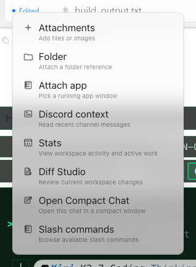

# How to: Plus Tools Menu

**Platform:** Electron

## What it is
The Plus Tools menu is the composer's "+" popover for adding context to a message — file/image and folder attachments, an attached app window for Screen Watch, and Discord channel context — plus quick links to workspace and command tools like Stats, Diff Studio, Open Compact Chat, and Slash commands.

## Where to find it
Click the **+ button** at the start of the composer's action row (next to the prompt input, identified by the plus icon). The popover is a single untitled list; the workspace and command entries at the end are omitted in General (non-workspace) chats.

## How to use it
1. Click the **+** button to open the popover.
2. Choose an entry:
   - **Attachments** — opens a file picker (multi-select, any file type) and adds the selected files as attachments, up to 15 at a time.
   - **Folder** — attaches a folder reference; the agent receives scoped reads of that folder's contents, carried through solo and Ensemble runs. Disabled in General chats, which have no workspace.
   - **Attach app / Detach app** — pick a running app window to watch (Screen Watch), or detach/stop a live capture already in progress.
   - **Discord context** — pull recent messages from a Discord channel into the chat's context (only available once a chat is selected).
   - **Stats** — view workspace activity and active work.
   - **Diff Studio** — review current workspace changes in the Inspector panel.
   - **Open Compact Chat** — open the current chat in a compact window.
   - **Slash commands** — browse the available slash commands.

## Tips & related
- [Provider, Model, and Permissions Pickers](provider-model-permissions-pickers.md) — the other composer pickers next to the + button.
- [Slash Commands](slash-commands.md) — full reference for the slash command menu this popover opens.
- [Inspector Panel](../transcript-and-search/inspector-panel.md) — where Diff Studio opens.
