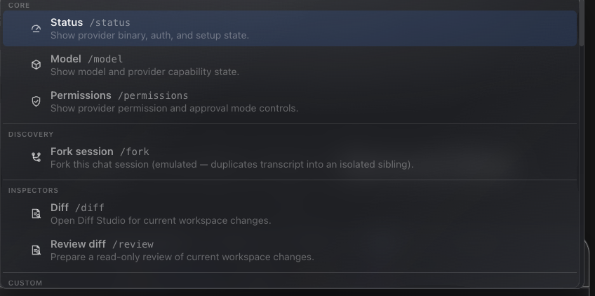

# How to: Slash Commands

**Platform:** Electron

## What it is
The slash command menu is a searchable popup in the composer that lists provider commands (like `/status`, `/model`, `/diff`) alongside TaskWraith's own actions (like `/clear`, `/files`, `/settings`) and prompt templates (like `/explain`, `/test`). Picking one either runs an action immediately or inserts text at your cursor.

## Where to find it
Open it from the **chat composer** in three ways:
- Type `/` at the start of a word in the composer.
- Press **⌘K** (Ctrl+K on Windows/Linux) while the composer is focused.
- Click the **+ (plus) menu** in the composer toolbar and choose **Slash commands**.

## How to use it
1. Open the menu with `/`, ⌘K, or the **+** menu's **Slash commands** entry.
2. Keep typing after the `/` to filter by command, label, or description.
3. Use **Arrow Up/Down** to highlight an entry, then **Enter** or **Tab** to pick it (or click it).
4. Press **Escape**, or click outside, to dismiss the menu without picking anything.
5. Some commands take an argument — type it after the command name (e.g. `/audit deep`, `/settings providers`, `/goal pause`) before submitting.

Commands fall into a few groups:
- **Provider commands** (vary by provider, e.g. Codex's `/status`, `/model`, `/fast`, `/diff`, `/mcp`, `/review`, `/resume`, `/fork`, `/permissions`) — passed through to that provider.
- **TaskWraith actions** — `/audit`, `/goal`, `/plan`, `/import-plan`, `/clear`, `/attach`, `/screen`, `/detach-screen`, `/schedule`, `/terminal`, `/canvas`, `/multiview`, `/stop` (alias `/cancel`), `/copy-transcript` (alias `/copy`), `/files`, `/workbench`, `/editor`, `/diff-window`, `/side`, `/side-drawer`, `/side-popout`, `/side-main`, `/help`, `/feedback`, and `/settings`.
- **Ensemble actions** — `/ensemble` turns Ensemble on or off for the chat; in ensemble chats you also get `/ensemble-turn`, `/ensemble-continuous`, `/ensemble-fanout`, `/ensemble-context`, `/ensemble-hops`, `/ensemble-reflect`, `/ensemble-skip`, `/ensemble-skip-reads`, `/ensemble-steer`, and `/blackboard`.
- **Prompt templates** — `/compact` (plus `/compact-shared` and `/compact-selected` in ensemble chats), `/explain`, `/test`, and `/review-diff` insert canned prompt text instead of dispatching an action.
- **Insert shortcuts** — `/discuss` inserts a provider-recognized prefix without dispatching anything. Its former `/meta` alias is no longer listed, though hand-typing `/meta` still works.

## Tips & related
- [Plus Tools Menu](plus-tools-menu.md) — the popover whose **Slash commands** entry opens this menu, alongside attachments, screen watch, and other composer tools.
- [Goal Button](goal-button.md) — the `/goal` command is an alternate way to set or manage the chat's active goal.
- [Provider, Model, and Permissions Pickers](provider-model-permissions-pickers.md) — which provider is active determines which provider-specific slash commands (like `/status` or `/fast`) appear.
