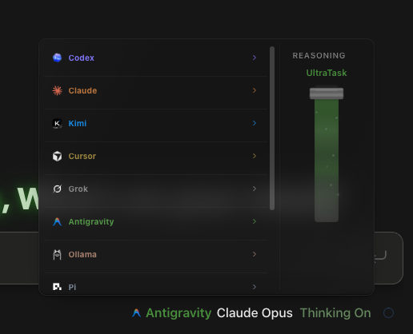

# How to: UltraTask

**Platform:** Electron

## What it is
The top setting on the composer's **Reasoning** ladder. It runs your request as a staged job instead of one answer: several scouts research the problem in parallel, a worker produces the result, a separate reviewer checks it, and a final pass pulls everything together. Use it for work worth the extra time and tokens, not for quick questions.

## Where to find it
Click the **model chip** under the prompt box. **UltraTask** is the highest stop on the **Reasoning** ladder, above **Ultracode**.

## How to use it
1. Click the **model chip** and pick a model that supports UltraTask.
2. Drag the **Reasoning** slider to the top, to **UltraTask**.
3. Type the task. Give it a real goal and how you will know it is done — the extra stages only help if the target is clear.
4. Send. The stages run in order and you get one final answer built from all of them.

## Tips & related
- **UltraTask only appears on models that support it.** If the ladder stops at Max or Ultracode, that model cannot run it — switch models rather than looking for a setting.
- It uses the highest reasoning your chosen model offers, so expect it to be slower and more expensive than a normal turn.
- TaskWraith decides how many scouts to run. There is no setting for it, so nothing to tune.
- Every stage inherits the chat's permission level. UltraTask never grants itself more access than you gave it — set the permissions chip to **Ask** and the whole job stays look-only.
- [Provider, Model, and Permissions Pickers](provider-model-permissions-pickers.md) — the ladder UltraTask sits on top of.
- [Model Catalogue](../../MODEL_CATALOGUE.md) — which models offer which reasoning levels.
