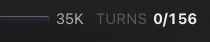

# How to: Continuous Hops Meter

**Platform:** Electron

## What it is
The Continuous Hops Meter is the `n/m` chip that tracks admitted continuation
turns in a Continuous-mode ensemble round. Those turns can come from an explicit
mention/yield or from the autonomous roster passes TaskWraith starts after a
pass drains without a handoff. For example, `2/6` means two of six continuation
turns have been used. Click the chip to change the maximum (`m`); the current
count (`n`) is read-only. The popover still labels this limit "Max handoff
turns," but the runtime budget covers both paths.

## Where to find it
In the labeled **Turn Budget** cell on the second row of the Roster Presets section above the composer input, next to the Fan-Out toggle. Ensembles always run Continuous, so the chip is always available.

## How to use it
1. Ensembles always run Continuous: after the initial roster drains,
   TaskWraith can run another pass even when nobody explicitly mentions a
   peer or calls `ensemble_yield`. A low cap approximates the retired
   turn-based mode (roughly one pass and done).
2. Watch the **Turn Budget** chip — it shows admitted continuation turns used so
   far out of the cap, for example `2/6`. Each participant admitted into an
   autonomous follow-up pass consumes one turn.
3. Click the chip to open the "Max handoff turns" popover, type a new limit (1–500), and click **Set**.
4. If a round is already in flight, the new cap applies to that round immediately; when idle, the chip's denominator reflects your new setting right away.

## Tips & related
- [Mention & Yield Routing](mention-yield-routing.md) — how explicit handoffs consume the same budget as autonomous passes.
- [Create an Ensemble Chat](create-ensemble-chat.md) — start an ensemble chat.
- [Fan-Out Toggle](fan-out.md) — the separate parallel-lanes control beside this chip.
- [Round Cards in Transcript](round-cards.md) — see how a continuous round's handoffs appear in the transcript.
