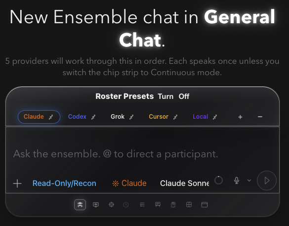

# How to: Create an Ensemble Chat

**Platform:** Electron

## What it is
An Ensemble chat is a single thread where multiple admitted provider agents
take part in the same conversation and respond in turn, instead of you running
separate single-provider chats. The eight static-live providers are Claude,
Codex, Kimi, Cursor, Grok, Ollama, Pi, and Mistral; AntiGravity is
conditionally offered after its consent/credential setup, and Gemini remains
history-only. Every seat
still passes its runtime admission. Kimi's structural ACP admission runs in
every build; an admitted binary without a reviewed roster tuple is labelled
`unattested-development`. Cursor participates like any other admitted seat and
can use `ensemble_yield` when its TaskWraith tool gateway is active.

## Where to find it
Open a new draft and turn on the **Ensemble** button in the composer's bottom row before your first send, click the **+** button in the sidebar's **Ensembles** section header, or use the same **Ensemble** button in an existing top-level idle chat to convert that thread in place.

## How to use it
1. Create a new draft, then open the **Ensemble** button in the composer's bottom row and choose **On** before your first send (or click the **+** on the **Ensembles** section header). The draft switches to Ensemble — there's no setup modal.
2. To convert an existing normal chat, wait until the thread is idle, then use the same **Ensemble** button. The chat flips in place on the same thread and keeps its history.
3. The draft or converted chat opens with a default panel of participants already enabled, shown as a chip strip above the composer. In the source-ahead checkout, brand-new ensembles use a compact panel of up to four configured providers: the active provider starts as Boss, followed by Captain, Specialist, and an independent Outsider when enough seats are available. A barely configured install falls back to the same four-seat recommended panel, and users can still add seats up to the 30-participant ceiling. Converting an existing single-provider thread seeds exactly one participant from that thread.
4. Click a chip to select that participant; the composer's model and permissions pickers below now read and write that participant's settings. Click the selected chip again to open its overflow popover, where you can enable/disable it, rename its role, or edit its brief.
5. Drag a chip to reorder the speaking sequence, then type your prompt and send — each enabled participant responds in turn according to that order.
6. To collapse an ensemble back to a single-provider chat, use the **Ensemble** button again while the thread is idle and choose the canonical provider for the solo thread.

## Tips & related
- [Participant Chip Strip](participant-chip-strip.md) — full detail on selecting, reordering, and editing participants.
- [Saved Roster Presets](saved-roster-presets.md) — apply a saved line-up instead of editing the default panel by hand.
- [Ensemble Mode Picker](../composer/ensemble-mode-picker.md) — choose Turn or Continuous orchestration for the chat.
- [Round Cards in Transcript](round-cards.md) — how completed rounds are displayed once the ensemble starts responding.
