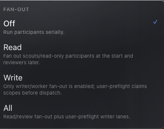

# How to: Fan-Out Toggle

**Platform:** Electron

## What it is
The Fan-Out toggle is the **Off / Read / Write** button group (labeled **Fan-Out**) that lets an ensemble round dispatch multiple participants in parallel lanes instead of one at a time, so they can investigate simultaneously and report back before the round continues.

## Where to find it
In an ensemble chat, it sits in the labeled **Fan-Out** cell on the second row of the Roster Presets section above the composer input, right beside the Turn / Continuous / Work Session orchestration mode picker.

## How to use it
1. In an active ensemble chat, find the **Fan-Out: Off / Read / Write** buttons next to the mode picker.
2. Click **Off** to keep participants running serially, one at a time (the default).
3. Click **Read** to let read-only participants run in parallel lanes; a writer-capable participant still runs serially afterward. This requires parallel lanes to be enabled (`TASKWRAITH_CONCURRENT_LANES`, on by default) — if disabled, rounds fall back to serial dispatch.
4. Click **Write** to allow writer-capable participants into parallel lanes too. This option is locked unless `TASKWRAITH_CONCURRENT_WRITE_LANES` is enabled, and it behaves differently depending on setup: if the chat has an assigned Boss, that Boss must call the `ensemble_fanout` tool with explicit write scopes; otherwise it's mediated by a user-enabled write-scope preflight (claim scopes, a host conflict check, then an acknowledgement) before any writer lane runs.
5. Hover the toggle group, or the running round's status, to see a summary of the active fan-out policy (e.g. "+ Read fan-out" or "+ Writer fan-out").
6. To keep a participant out of ordinary rotation, set its Stage to **BG**. A
   unique `@BG`, `@Background`, `@Role`, or `@Model` mention attempts to launch
   that seat asynchronously through the same lane executor. Concurrent lanes
   must be enabled, the seat must not already be active, and admission/budget
   checks must pass. Automatic mention/yield launches are capped read-only; use
   the existing Boss-authorized
   `ensemble_fanout(mode=locked_writers, targetStage=backgrounds,
   writeScopes=...)` path when scoped background mutation is genuinely required.

## Tips & related
- [Ensemble Mode Picker](../composer/ensemble-mode-picker.md) — the adjacent Turn/Continuous/Work Session control this toggle composes with.
- [Continuous Hops Meter](continuous-hops-meter.md) — the handoff-budget chip shown when Continuous mode is active alongside fan-out.
- [Create an Ensemble Chat](create-ensemble-chat.md) — start an ensemble chat before this toggle becomes available.
- [Participant Chip Strip](participant-chip-strip.md) — manage which participants are read-only vs. writer-capable, which determines what each fan-out lane can do.
- Normal round completion waits for live BG lanes, while Stop/cancellation closes immediately and cancels them with the rest of the round.
- BG lanes never inherit Trusted Session and cannot own Boss/Captain/synthesizer authority.
