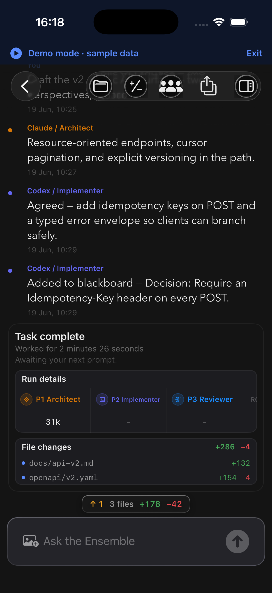

# How to: iOS Ensemble UI

**Platform:** iOS

## What it is
In an Ensemble chat on the iOS companion, a row of participant chips sits above the composer. Each shows a provider, a status mark, and a crown on the Boss. Tapping a chip opens the full **Roster** page, where you add, reorder, and configure participants and apply presets shared with your Mac.

## Where to find it
Open any Ensemble chat on the companion — the strip appears above the message field. Tap a chip, or the **Roster** icon in the thread toolbar, to open the Roster page.

## How to use it
1. Read the chips above the composer: provider glyph, role label, and status (a tick when done, bold while speaking, a lock for a retired provider).
2. Tap **+** at the end of the strip to add a participant, or tap a chip to open the Roster page on it.
3. On the Roster page, drag a row to change the speaking order, or swipe it to remove. Tap **Edit** to get the list's edit and delete controls.
4. Tap a participant row to set its model, reasoning effort, permissions, role, and brief — and to enable or disable it. Mark one participant **Boss** here.
5. In **Orchestration**, set **Fan-Out** to **Off** or **On**, and use the **Hops** stepper to set the handoff limit. It shows used out of the limit, and accepts 1 to 500.
6. Use **Presets** at the top to save the current line-up or apply a saved one.
7. Tap **Done** to close the Roster page.

## Tips & related
- **Edit** is the list's edit mode, not an on/off switch — enabling and disabling a participant lives in its editor.
- The composer strip currently accepts fewer participants than the Roster page does, so add the later seats from the Roster page.
- [Create an Ensemble Chat](create-ensemble-chat.md) — start a multi-provider chat first.
- [Participant Chip Strip](participant-chip-strip.md) — the Mac equivalent.
- [Saved Roster Presets](saved-roster-presets.md) — how presets are shared between Mac and iOS.
- [Mention & Yield Routing](mention-yield-routing.md) — how mentions change who speaks next.
