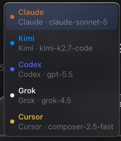

# How to: Mention & Yield Routing

**Platform:** Both

## What it is
In an Ensemble chat, `@Role` mentions and the `ensemble_yield` tool control which participant speaks next. Typing `@Role` in the composer sends the message to just that participant (a DM); a participant tagging `@Role` in their own reply, or calling `ensemble_yield(target: …)`, promotes that participant to the front of the queue for the next turn.

## Where to find it
Type `@` followed by a participant's role or model name in the composer during an ensemble chat — an autocomplete menu lists matching participants. Routing from a participant's own reply happens automatically whenever their response text contains an `@Role` mention or they call the `ensemble_yield` tool; there's no separate control to find for that half.

## How to use it
1. In the composer, type `@` and a few letters of a participant's role, provider, or model name (e.g. `@Researcher` or `@GPT 5.5`) and pick them from the autocomplete menu, or just keep typing the plain `@Role` token yourself.
2. Send a prompt that mentions exactly one participant to DM them directly — only that participant runs for the round, instead of the whole roster.
3. During a round, a participant can tag another in their own reply text (`"@Researcher, can you fact-check this?"`) to promote that participant to speak next; if the round is in **Continuous** mode and the tagged participant already spoke this round, they get an extra handoff turn instead.
4. A participant can also call the `ensemble_yield` tool with an optional `target` (and an optional `reason`) to explicitly hand off — this works the same as a mention but is an explicit tool call rather than text in the reply.
5. If a tagged name matches more than one participant (e.g. two participants on the same provider), the orchestrator posts an ambiguity notice in the round status and leaves routing unchanged — use a more specific role or model name to disambiguate.
6. A Boss participant's mentions take routing priority: if both the Boss and another participant are tagged in the same reply, only the Boss's target is promoted.

## Tips & related
- [Continuous Hops Meter](continuous-hops-meter.md) — the handoff budget that governs extra turns created by mentions and yields in Continuous mode.
- [Participant Chip Strip](participant-chip-strip.md) — shows each participant's role/model name, which is what you type after `@`.
- [Create an Ensemble Chat](create-ensemble-chat.md) — set up a chat with multiple participants before routing between them.
- [Round Cards in Transcript](round-cards.md) — see how yields and mention-promotions are noted in the round's transcript.
