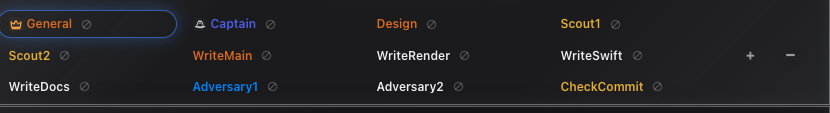

# How to: Participant Chip Strip

**Platform:** Electron

## What it is
A row of chips above the composer, one per participant in an Ensemble chat. Click a chip to select it, drag to reorder who speaks when, and double-click to set a seat's authority and stage.

## Where to find it
In an Ensemble chat, just above the message box — below the branch, files-changed, and Create PR rows. It also shows on a new Ensemble chat before you send anything, so you can set the panel up first.

## How to use it
1. Click a chip to select it. It gains a highlighted border, and the model and permissions chips below now edit that participant.
2. Double-click a chip to open its seat-role picker. Toggle **Enabled** to include or exclude it from rounds, and **Auto** for thread-wide Boss/Captain auto-approvals.
3. In the same picker, set authority — **Boss**, **Captain**, or **Agent** — then a stage: **Any**, **Scout**, **Work**, **Review**, or **BG**.
4. Drag a chip sideways to change the speaking order; drop it on or near another chip.
5. Click **+** at the end of the strip to add a participant, or select a chip and click **−** to remove it.

## Tips & related
- A panel needs at least 2 participants and holds up to 50. From 6 the strip wraps into balanced rows of at most 5 chips (7 → 3+4, 13 → 4+4+5) so role names stay readable.
- A **BG** seat sits out the normal rotation — `@`-mention it to start a background lane. Whether it launches still depends on parallel lanes being on and the seat being free.
- Each chip shows its state: idle, speaking, answered, yielded, failed, skipped, sleeping, unreachable, or cancelled. A failed or unreachable chip offers a retry button; a sleeping one offers **Wake now** / **Cancel wakeup**.
- While a round runs you cannot add or remove seats, but you can still inspect them, and **Skip** moves past whoever is speaking without cancelling the round.
- BG seats are workers, not round owners: do not make one Boss, Captain, or synthesizer. TaskWraith ignores conflicting authority at dispatch.
- [Create an Ensemble Chat](create-ensemble-chat.md) — get a chat with a chip strip in the first place.
- [Saved Roster Presets](saved-roster-presets.md) — apply a saved line-up instead of building one chip at a time.
- [Mention & Yield Routing](mention-yield-routing.md) — how mentions and yields override chip order.
- [Continuous Hops Meter](continuous-hops-meter.md) — the handoff budget shown alongside the strip.
