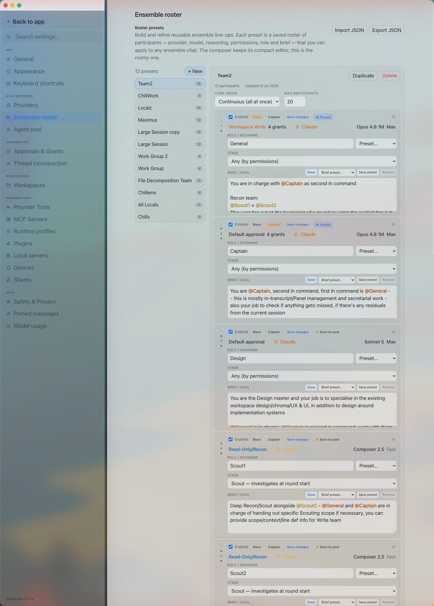

# How to: Saved Roster Presets

**Platform:** Electron

## What it is
A roster preset is a saved ensemble line-up — provider, model, reasoning, permissions, role, and brief for each participant, plus turn order and max-participant settings — that you can apply to start a new ensemble chat or swap into an existing one without rebuilding it by hand.

## Where to find it
Settings → **AI & Providers → Ensemble roster** for the full editor (create, duplicate, rename, delete, and edit every participant). A compact picker for applying a saved preset is also available from the composer's ensemble controls when starting or editing a chat.

## How to use it
1. Open **Settings → AI & Providers → Ensemble roster**. The left pane lists your saved presets; click **+ New** to create one. In the source-ahead checkout it starts as a three-seat Boss + Captain + Specialist panel, with room for a second specialist and an optional outsider, or you can select an existing preset to edit it.
2. In the right-hand editor, set **Turn order** (turn-based or continuous) and **Max participants**, then add, remove, or reorder participants with the row controls.
3. For each participant, pick a provider/model and permissions, write a **Role / nickname** and **Brief / goal**, toggle **Enabled**, and optionally assign one **Boss** plus one **Captain** as second-in-command.
4. Use **☆ Save to pool** on a row to turn that participant into a reusable Agent, or **+ Add from pool** to drop a saved Agent into the roster; pooled Agents stay linked, so editing the Agent later updates every preset that uses it.
5. Use **Duplicate** to branch a variation of a preset, or **Delete** to remove one you no longer need.
6. Apply a preset from the composer's roster picker to load its participants into the current or a new ensemble chat.

## Tips & related
- Keep a new panel small: three seats for ordinary delivery work, four when an independent review adds value, and five only when the task genuinely needs two specialist domains plus an outsider.
- [Create an Ensemble Chat](create-ensemble-chat.md) — start a multi-provider chat that a roster preset can populate.
- [Ensemble Mode Picker](../composer/ensemble-mode-picker.md) — orchestration mode settings (Turn / Continuous / Work Session).
- [Participant Chip Strip](participant-chip-strip.md) — the in-chat strip for adjusting participants once a chat is running.
- [Providers tab](../settings-and-configuration/providers-tab.md) — sign in to the providers a roster preset references.
