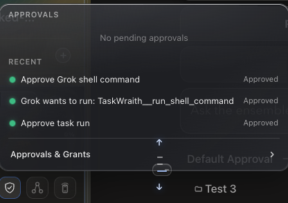

# How to: Approvals Popover

**Platform:** Electron

## What it is
The Approvals popover shows all pending agent approvals across your chats, lets
you jump to the requesting chat, and provides a deep link to **Settings →
Approvals & Grants**. It also shows TaskWraith Host reachability, configured
providers, awaiting Host approvals, the compact Mission Control projection, and
the Host's in-app lifecycle control.

## Where to find it
In the **Sidebar footer control row** — click the **red shield** icon.

## How to use it
1. Click the red shield to open the popover.
2. Review the pending approvals list.
3. Click an item to jump to its chat, or click the Settings link to manage grants.
4. Expand **Mission Control** to inspect live/cached Host missions,
   participants, runs, questions, approvals, and Channels.
5. Use **Stop Host** or **Start Host** when you intentionally want to change
   Host availability. Host runs only while TaskWraith is open; this control does
   not install a daemon or leave a background service behind.

Host distinguishes **Stopped by you** from **Unreachable** and **Last known
state**. Cached state remains visible but is not treated as live authority, so
governed controls stay disabled until Host is running with a live projection.

## Tips & related
- [Approval Ledger](../approvals-and-permissions/approval-ledger.md) — full audit history.
- [Pending approval modal](../approvals-and-permissions/pending-approval-modal.md) — the modal that blocks a turn.
