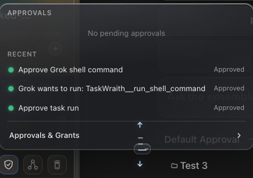

# How to: Approvals Popover

**Platform:** Electron

## What it is
The Approvals popover shows all pending agent approvals across your chats in one place. Click an item to jump to its chat, or follow the link to **Settings → Approvals & Grants**. It also shows TaskWraith Host status and an expandable **Mission Control** section.

## Where to find it
In the **Sidebar footer control row** — click the **yellow shield** icon.

## How to use it
1. Click the yellow shield to open the popover.
2. Review the pending approvals list.
3. Click an item to jump to its chat, or click the Settings link to manage grants.
4. Expand **Mission Control** to inspect Host missions, participants, runs, questions, approvals, and Channels.
5. Use **Stop Host** or **Start Host** to change Host availability. The Host runs while TaskWraith or a TUI session is connected to it. It stops about 45 seconds after the last one closes. If work is still running at that point, it waits for the work to finish, for up to 30 minutes. To keep the Host running regardless, set `TASKWRAITH_HOST_PERSIST=1` before launching.

The status line tells **Stopped by you** apart from **Unreachable**. Cached info stays visible but counts as **Last known state**, not live data.

## Tips & related
- [Approval Ledger](../approvals-and-permissions/approval-ledger.md) — full audit history.
- [Pending approval modal](../approvals-and-permissions/pending-approval-modal.md) — the modal that blocks a turn.
