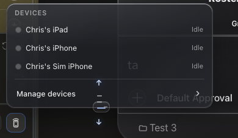

# How to: Devices Popover

**Platform:** Electron

## What it is
The Devices popover shows the status of paired iOS devices and provides a quick link to **Settings → Devices** for pairing, workspace allowlists, and networking.

## Where to find it
In the **Sidebar footer control row** — click the **green devices** icon (when iOS remote is enabled).

## How to use it
1. Click the green devices icon to open the popover.
2. Review paired devices and their connection status.
3. Click the Settings link to pair a new device or manage networking.

## Tips & related
- [Devices tab](../settings-and-configuration/devices-tab.md) — full pairing and networking settings.
- [iOS ensemble UI](../ensemble-mode/ios-ensemble-ui.md) — using TaskWraith on your iPhone.
