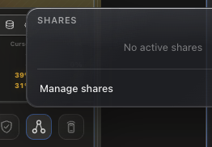

# How to: Shares Popover

**Platform:** Electron

## What it is
The Shares popover shows your active human-collaboration shares — shared chats you have invited others to join.

## Where to find it
In the **Sidebar footer control row** — click the **yellow shares** icon.

## How to use it
1. Click the yellow shares icon to open the popover.
2. Review active shared chats and their collaborators.
3. Click an item to jump to the shared chat or manage access.

## Tips & related
- [Shares tab](../settings-and-configuration/shares-tab.md) — full management page for shared chats.
- [Chat types](../chats-and-threads/chat-types.md) — learn about shared chats.
