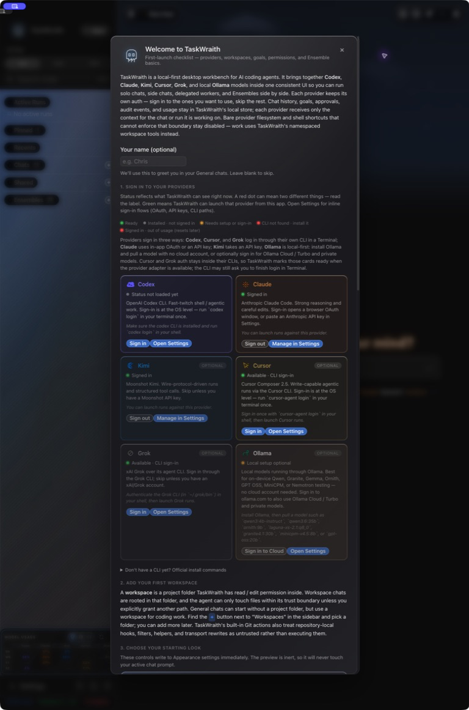

# How to: First Launch Sheet

**Platform:** Electron

## What it is
The First Launch Sheet appears automatically on your first run of TaskWraith. It provides a welcome introduction, a theme and composer preview, provider auth status cards with deep links to Settings, and a workspace hint to get you started.

## Where to find it
It appears automatically the first time you launch TaskWraith. You can reopen it later by clicking the **?** button in the chat-corner rim.

## How to use it
1. Review provider status, then use the explicit **Sign in**, **Open Settings**, or **Manage in Settings** button on a card; the card body itself is informational.
2. Follow the workspace hint to add your first workspace.
3. Scroll to **Choose your starting look** to select a theme, composer shell, and message-bubble colour while viewing the inert composer preview.

## Tips & related
- [Add workspace](add-workspace.md) for setting up your first workspace.
- [Settings entry](../sidebar-navigation/settings-entry.md) to open Settings manually.
