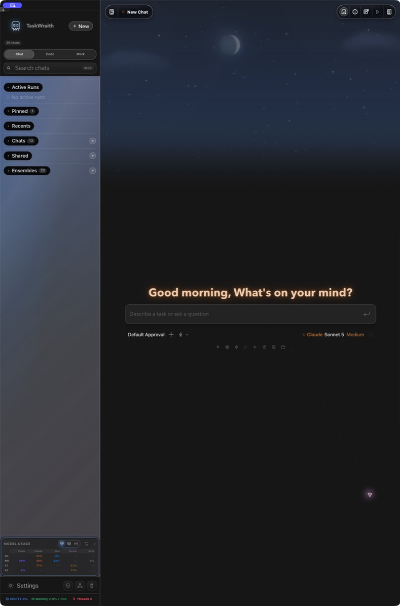

# How to: Welcome Screen

**Platform:** Electron

## What it is
The Welcome Screen is the view for a selected, pristine draft that has no conversation content and no run in progress. A General draft shows the time-aware greeting and composer without workspace dashboards. A workspace draft can also show provider usage and activity dashboards. When Epic FX and **Weather/Sky** are enabled, the ambient backdrop follows approximate local weather, daylight, and astronomy.

## Where to find it
Appears automatically in the **center stage** when TaskWraith selects a new, still-empty General or workspace draft.

## How to use it
1. Type a task or question in the composer to begin a new chat.
2. In a workspace draft, review the optional dashboard tabs for provider token/cost summaries and Agent-pool activity.
3. In a workspace draft, explore the activity heatmaps when they are enabled and data is available.
4. Use the corner FX menu, or **Settings → App → Appearance**, to show or hide the Weather/Sky backdrop.

## Tips & related
- [First Launch Sheet](first-launch-sheet.md) — shown on very first run.
- [Add workspace](add-workspace.md) to populate the sidebar so chats appear.
- [Appearance tab](../settings-and-configuration/appearance-tab.md) — configure Epic FX and Weather/Sky visuals.
