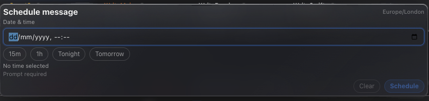

# How to: Routines and scheduled tasks

**Platform:** Electron

## What it is
TaskWraith runs agent prompts on a schedule instead of immediately, in two forms: a **one-shot** schedule on a single composer message, and a recurring **Workflow** (manual or interval trigger) that re-runs a saved prompt template. Both are dispatched through the same underlying scheduled-task queue.

## Where to find it
For a single message: the **clock icon** in the composer's control row. For recurring runs: the **Workflows** section in the sidebar (below Active Runs and Local Servers), including its **+** button to create one.

## How to use it
1. To schedule a single prompt, click the **clock icon** in the composer, pick a date/time (or a quick preset like **15m**, **1h**, **Tonight**, **Tomorrow**), then click **Schedule** and send as usual — it fires automatically at that time.
2. To set up a recurring routine, click the **+** next to **Workflows** in the sidebar. This opens a new chat in workflow-compose mode (requires an open workspace).
3. Choose a **cadence** — **Manual** (only runs when you trigger it) or **Every** with an interval in minutes — set a **Max runs per day** cap, and choose the **Unattended permissions** level the workflow runs with when you're not watching.
4. Type the prompt and send it; the first send saves these settings as the workflow's definition and turns that chat into its running thread.
5. Manage an existing workflow from its row in the **Workflows** sidebar section: expand it to **Run now**, **Pause/Resume**, edit its **cadence**, grant/revoke **unattended permissions**, **Cancel** an active run, or **Delete** it.

## Tips & related
- [Schedule Prompt](../composer/schedule-prompt.md) — details on the one-shot composer schedule control.
- [Workflow Creator](../workflows-and-boards/workflow-creator.md) — full walkthrough of creating a recurring workflow.
- [Workflow Compose Controls](../workflows-and-boards/workflow-compose-controls.md) — cadence, interval, and unattended-permission options in depth.
- [Workflows Sidebar Section](../workflows-and-boards/workflows-sidebar-section.md) — managing, running, and deleting workflows after creation.
