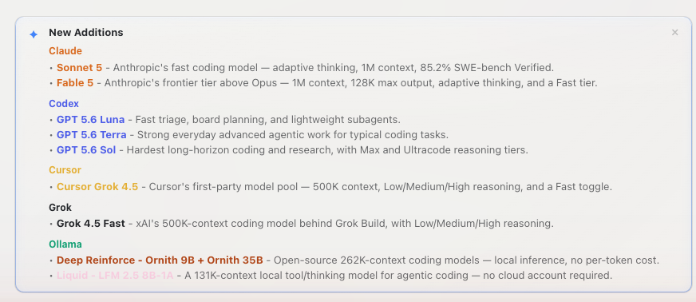

# How to: Notification zone

**Platform:** Electron

## What it is
The notification zone is a rotating card that surfaces significant, app-authored announcements — new providers or models, deprecations, and shipped features. It shows one notice at a time and never appears if there is nothing to announce.

## Where to find it
It appears on the welcome / new-thread screen (the center stage shown when no chat is selected) and on the First Launch Sheet shown on your first run.

## How to use it
1. Read the current card; deprecation/sunset notices are shown in red, everything else uses the theme-default card style.
2. If more than one notice is active, use the **‹** / **›** arrows, the dots below the card, or a swipe gesture to move between them — the zone auto-rotates every 90 seconds.
3. Click the **×** on a card to dismiss it; dismissal is remembered so it won't reappear (some notices are not dismissible and stay until they expire).

## Tips & related
- [Welcome Screen](../getting-started/welcome-screen.md) — the notification zone appears here when no chat is selected.
- [First Launch Sheet](../getting-started/first-launch-sheet.md) — the notification zone also appears here on your first run.
