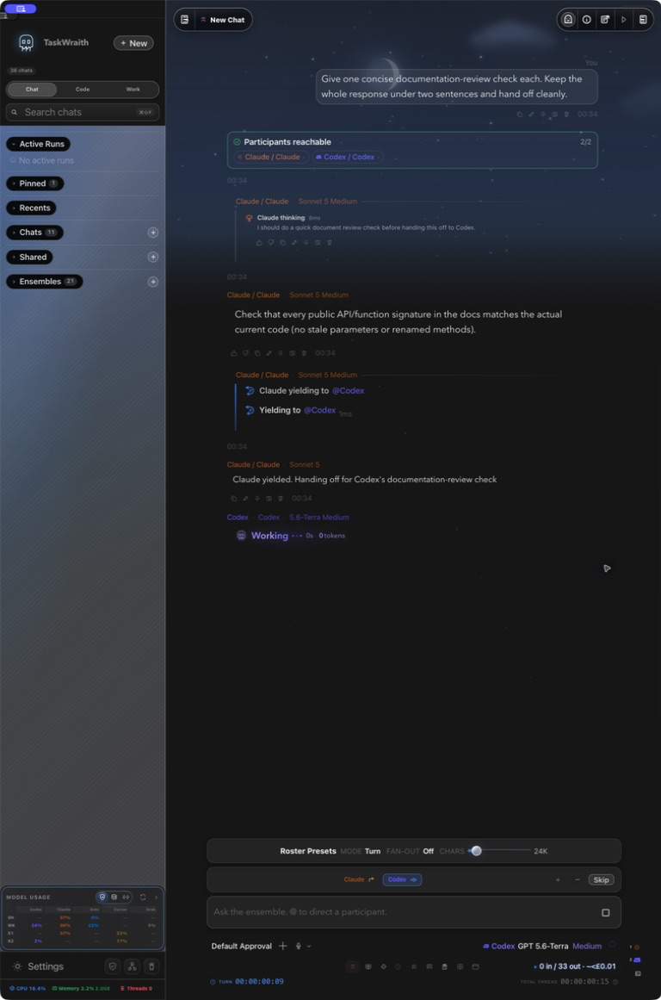

# How to: Participant health

**Platform:** Electron

## What it is
The participant health card is a compact status summary that appears in an Ensemble chat's transcript before each round runs. It probes every participant scheduled to speak and shows which are reachable and which aren't, with a chip-style strip of provider/role tags and per-chip status icons.

## Where to find it
Participant health cards appear automatically, inline in the transcript, in any Ensemble chat — they're inserted just before a round dispatches, as the orchestrator's pre-flight check on each participant. You don't open them from a menu; they show up as part of the conversation flow alongside round cards and other ensemble messages.

## How to use it
1. Watch for the card's header at the top of each round: "Participants reachable" with a green check if everyone in the round responded to the probe, or "Participant health" with a warning triangle if one or more didn't. The header also shows an `okCount/totalCount` tally.
2. Scan the chip strip below the header — each chip shows the provider icon, the participant's provider/role label, and a small status dot (`·` for ok, `⚠` for unreachable).
3. For an unreachable participant, read the short reason shown inline on its chip (e.g. a connection or socket error); hover the chip for the full tooltip, which adds the underlying error code when available.
4. If a participant was marked unreachable, use the chip strip above the composer to retry it — an unreachable chip there shows an inline retry button — or fix the underlying issue (e.g. start the local Ollama server) before running the next round.

## Tips & related
- [Participant Chip Strip](../ensemble-mode/participant-chip-strip.md) — the live roster strip above the composer, including the retry button for unreachable participants.
- [Round Cards in Transcript](../ensemble-mode/round-cards.md) — how completed rounds (including their health cards) collapse in the transcript.
- [Create an Ensemble Chat](../ensemble-mode/create-ensemble-chat.md) — set up the multi-agent chat where these pre-flight checks run.
- [Provider health chips](provider-health-chips.md) — related connectivity status shown for individual providers outside of ensemble rounds.
