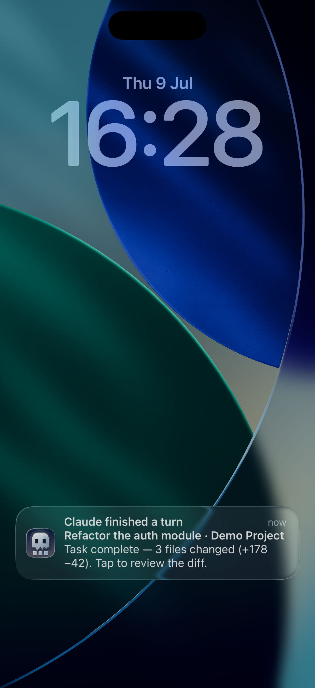

# How to: Push notifications

**Platform:** Both

## What it is
Push notifications wake a paired iPhone or iPad when it's backgrounded or locked: an approval or question waiting on you, or a run finishing (success or failure). The Mac sends a routing-only Apple Push Notification (no message content inside the push itself); the phone shows a generic alert, or — if your Mac is reachable and the device registered an encryption key — a richer banner with the run's title and a short preview, hydrated locally over the encrypted device link.

## Where to find it
Push notifications arrive as system notifications on the paired iPhone/iPad — there's no in-app notification list to open. They only fire while the device isn't already connected and active in the app, and never while you're at the Mac (an "at desktop" check suppresses them so you don't get redundant alerts). The credentials that enable them live in **Settings → Integrations → Devices**, under **Bridge networking → Apple Push Notifications (APNs)**.

## How to use it
1. Pair your iPhone or iPad with the Mac first (see the Devices tab) — push notifications only reach paired devices.
2. On first launch after pairing, allow the notification permission prompt iOS shows you; this registers the device for pushes and re-registers automatically on later launches.
3. On the Mac, open **Settings → Integrations → Devices → Bridge networking** and add your Apple Push Notifications Auth Key (.p8), Key ID, and Team ID under **Apple Push Notifications (APNs)** — pushes stay inactive for every paired device until this is configured.
4. Use **Send test push** in that panel to confirm delivery to your registered device(s) before relying on it.
5. When a push arrives for an approval, tap **Approve** or **Deny** directly on the lock screen (Face ID/passcode is required to confirm), or tap **Open** on a question push to jump into TaskWraith and answer it there.
6. Tapping a run-finished notification (or any notification body) opens TaskWraith to the relevant chat.

## Tips & related
- [Devices tab](../settings-and-configuration/devices-tab.md) — pair a device and configure the APNs credentials that push notifications depend on.
- [Devices popover](../footer-control-row/devices-popover.md) — quick paired-device status view in the sidebar footer.
- [Pending Approval Modal](../approvals-and-permissions/pending-approval-modal.md) — the desktop counterpart to the Approve/Deny push you get on a locked phone.
- [Agent question cards](../transcript-and-search/agent-question-cards.md) — the in-chat card a question push deep-links you to.
