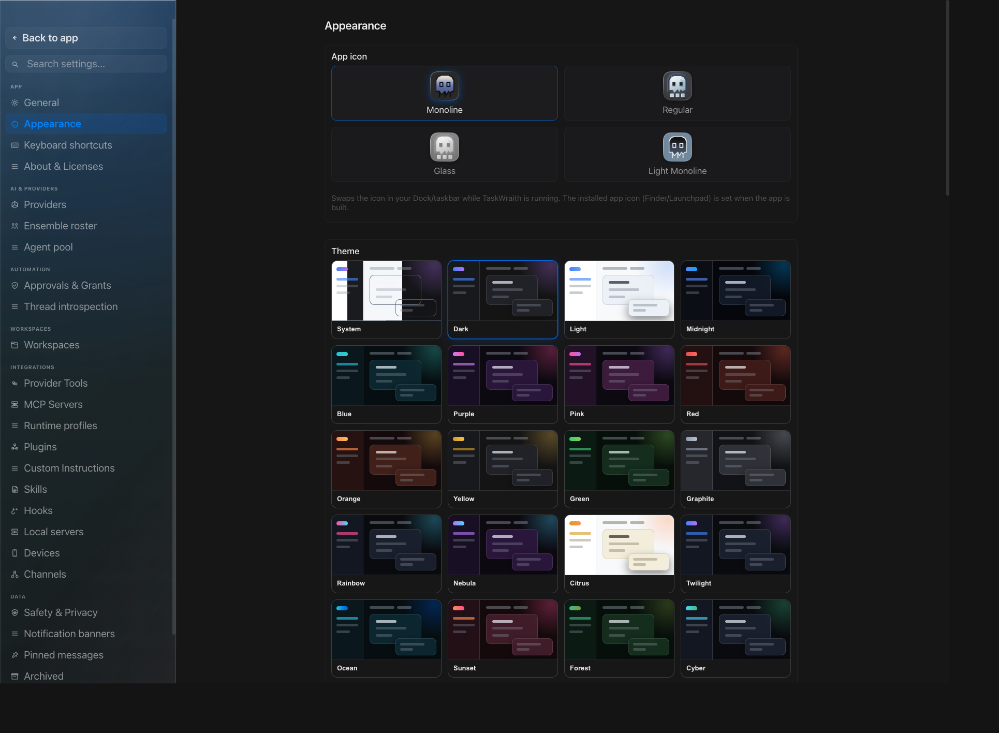

# How to: Appearance tab

**Platform:** Electron

## What it is
The Appearance tab is where you customize TaskWraith's look: app icon, theme, corner style, accent and bubble color, diff stat colors, composer/transcript fonts, window material, pane opacity, and optional FX Labs visual effects.

## Where to find it
Open **Settings → App → Appearance**.

## How to use it
1. Pick an **App icon** variant to swap the Dock/taskbar icon while TaskWraith is running.
2. Choose a **Theme** from the preview cards — System, Dark, Light, or a named palette such as Midnight, Graphite, Nebula, or Sage. Each card is a miniature workspace, and its code sample borrows your diff stat colors.
3. Under **Accent & chat bubble**, set one shared color — with Hue, Saturation, and Luma sliders plus hex and RGB fields — that drives the interface accent, your message bubble, and its "You" label. The same control carries the **Corners** choice (Round or Hard) for message bubbles.
4. Under **Diff stat colors**, set the **Additions** and **Deletions** colors used for diff counts (each can be reset to its default).
5. Under **Composer Preview**, choose the interface shell and pick transcript/composer fonts (or load installed system fonts and enter a custom font name); the live preview updates as you type.
6. Under **Effects & Material**, set the window material (Solid, Soft Glass, or Native Glass), adjust sidebar and main pane opacity, choose a glass style, and toggle accessibility options like Reduce transparency and Reduce motion.
7. Toggle **Compact density**, **Live activity viewport**, and the **Prompt bubble** style to adjust layout density and how the agent's activity streams in.
8. Enable **Epic FX** and pick an intensity mode, then opt into individual **FX Labs** layers (e.g. Agent Aura, Living Workspace) for extra ambience — these are disabled automatically when Reduce motion is on.

## Tips & related
- [General tab](general-tab.md) — other core app behavior settings live alongside Appearance under Settings → App.
- [Keyboard shortcuts tab](keyboard-shortcuts-tab.md) — another Settings → App tab for customizing keybindings.
- [Welcome Screen](../getting-started/welcome-screen.md) — one of the surfaces where your theme and effects choices are visible.
- [Motion, transitions & haptics](../motion-and-transitions/) — contributor guide for tokens, presence recipes, DigitOdometer / NumericTickText, and the reduce-motion contract (Reduce motion in this tab feeds that system).
