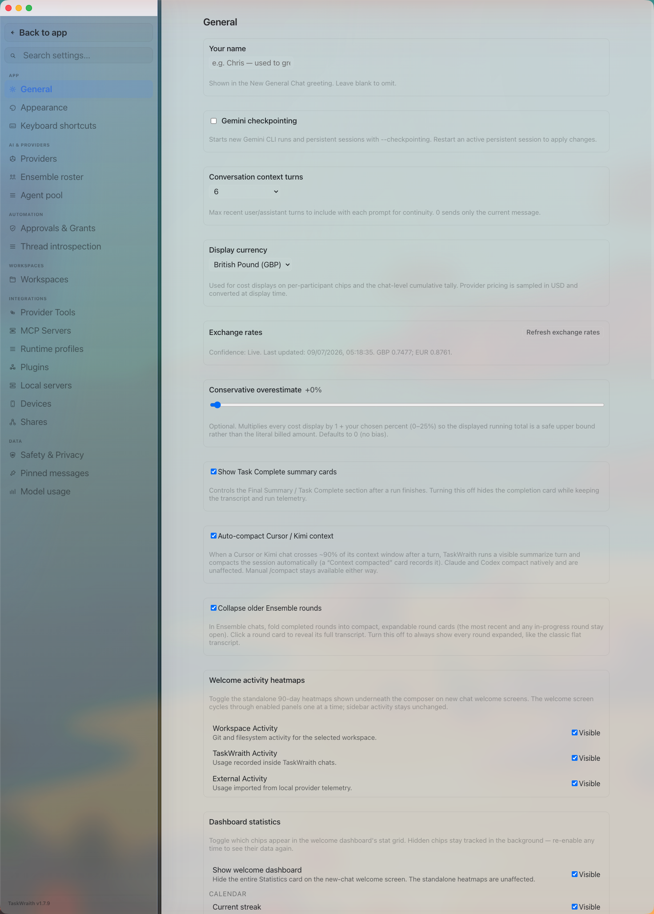

# How to: General tab

**Platform:** Electron

## What it is
The General tab holds TaskWraith's core behavior settings: your display name, conversation context length, display currency, Task Complete and Ensemble round cards, welcome-screen heatmaps and dashboard stats, the Kimi compatibility filter, approval timeouts, a danger-zone chat history wipe, and a collapsed disclosure of troubleshooting and audit-export actions.

## Where to find it
Open **Settings → App → General**.

## How to use it
1. Set **Your name** so New General Chat greetings can address you by name.
2. Choose **Conversation context turns** to control how many recent user/assistant turns are sent with each prompt (0 sends only the current message).
3. Pick a **Display currency** (USD, GBP, or EUR) for cost chips, refresh exchange rates, and optionally dial in a **Conservative overestimate** percentage (0–25%) so displayed costs over-shoot the real bill.
4. Toggle **Show Task Complete summary cards** and **Collapse older Ensemble rounds** to control how finished runs and ensemble rounds are presented in the transcript.
5. Under **Welcome activity heatmaps** and **Dashboard statistics**, show or hide individual heatmaps and stat chips on the new-chat welcome screen, control the Workspaces and Providers dashboard tabs (including auto-cycle timing), and reset dashboard stats back to today.
6. Enable the **Kimi compatibility filter** to redact known Moonshot-rejected topics from prompts sent to Kimi ensemble participants only — your transcript itself is never modified; optionally turn on the classifier retry pass and add custom trigger phrases.
7. Turn on **Auto-deny approvals after a timeout** and set the independent window for every currently offered provider, plus Main authority, so unanswered approvals don't block a run indefinitely. The defaults are Codex 60 seconds; Kimi, Mistral, and Main authority 120 seconds; and the other offered providers 240 seconds. Custom values can range from 5 seconds to 60 minutes.
8. Use **Delete chat history** in the danger zone to permanently remove TaskWraith-owned local chats; run, approval, feedback, workflow/queue, execution-graph, and mailbox history; Canvas workspaces/artifacts; regenerable transcript media and derived bytes; usage/project-reference artifacts; Kimi seat state; and the bridge diagnostic log. Provider-native history, provider credentials, workspace files, and settings are left intact. See [Trust & Safety](../../TRUST_AND_SAFETY.md#what-data-stays-local) for the source-ahead versus v1.8.4 boundary.
9. Expand **Advanced troubleshooting & audit data** at the bottom of the tab for support and retention actions: **Refresh health**, **Export diagnostics**, **Export full audit bundle**, **Verify audit bundle**, **Repair install**, and the scoped **Export workspace / chat / thread / run bundle** actions (each enabled only when that scope has something to export). Updates are not configured here — they are managed from the sidebar update pill.

## Tips & related
- [Appearance tab](appearance-tab.md) — visual/theme settings, also under Settings → App.
- [Keyboard shortcuts tab](keyboard-shortcuts-tab.md) — another Settings → App tab.
- [Safety and privacy tab](safety-and-privacy-tab.md) — approval and permission policy settings beyond timeouts.
- [Welcome Screen](../getting-started/welcome-screen.md) — where the heatmaps and dashboard stats you configure here are displayed.
