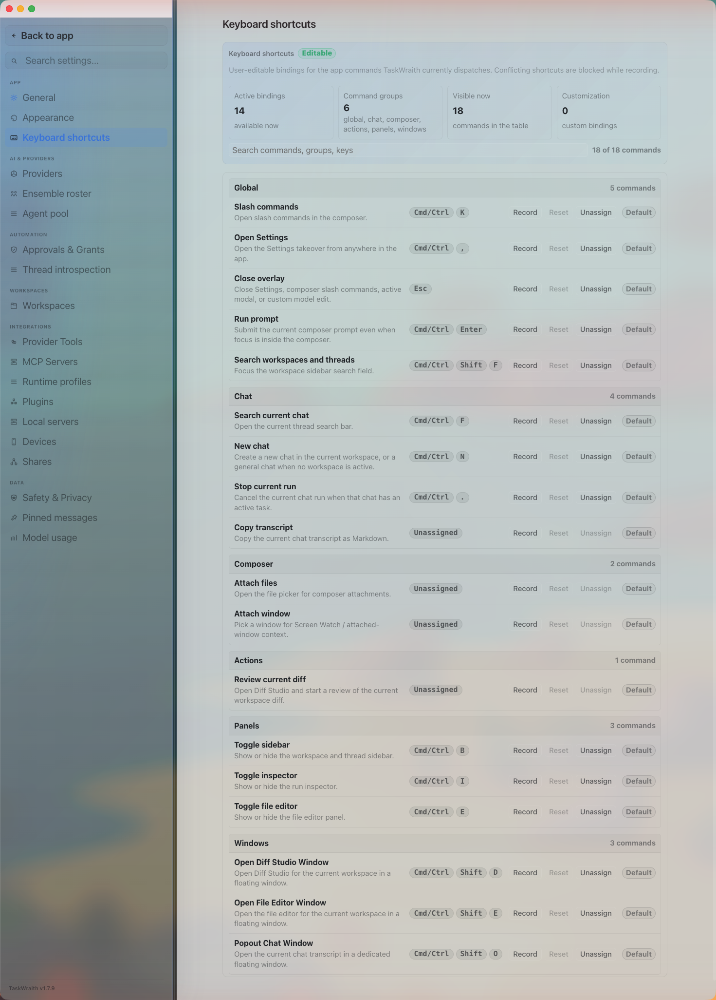

# How to: Keyboard shortcuts tab

**Platform:** Electron

## What it is
The Keyboard shortcuts tab lists every app command TaskWraith currently dispatches and lets you rebind, reset, or unassign each one. It is one of the **App** group tabs in Settings, alongside General, Appearance, and About & Licenses.

## Where to find it
Open the sidebar footer **Settings** entry, then choose **Keyboard shortcuts** under the App group in the Settings sidebar rail.

## How to use it
1. Browse the summary cards at the top for active binding counts, command groups, and how many shortcuts are visible or customized.
2. Use the search field to filter by command name, group, or key (e.g. "new chat" or "Cmd").
3. Find a command in its group section (Global, Chat, Composer, Actions, Panels, or Windows) and click **Record**, then press the new key combination. TaskWraith blocks the change if it conflicts with another command's shortcut.
4. Click **Reset** to restore a command's default binding, or **Unassign** to clear it entirely.
5. Click **Reset all** in the toolbar to revert every customized shortcut back to its default at once.

## Tips & related
- [Settings and Configuration](README.md) — overview of the full Settings takeover and its tab groups.
- [General tab](general-tab.md) — other core App-group behavior settings.
- [Appearance tab](appearance-tab.md) — theme and visual customization, also in the App group.
