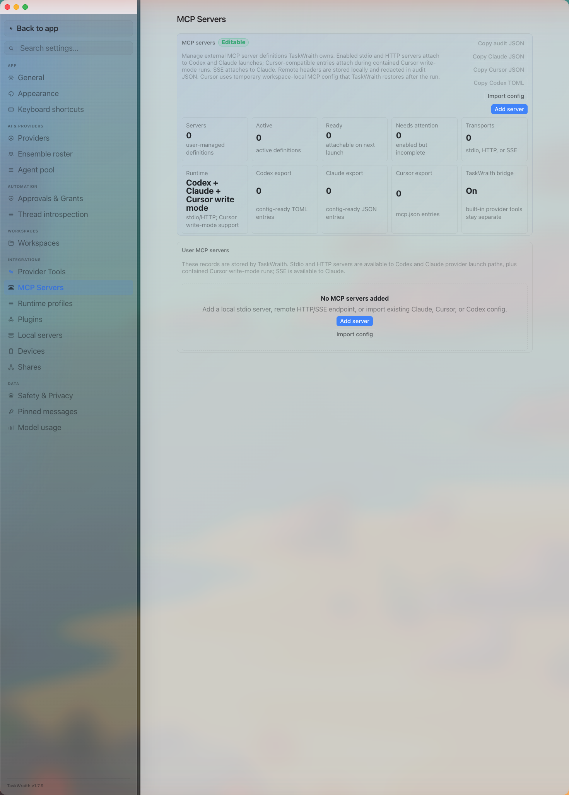

# How to: MCP servers tab

**Platform:** Electron

## What it is
The MCP Servers tab is where you add, edit, import, validate, and manage your
own MCP (Model Context Protocol) server definitions — stdio commands, HTTP
endpoints, or SSE endpoints. Enabled stdio and HTTP servers attach to Codex and
Claude launches; SSE servers attach to Claude only. These are separate from TaskWraith's own built-in MCP
bridge and tool catalog, which live on the Provider Tools tab.

In the current source-ahead checkout, TaskWraith starts no managed Cursor
process. Importing or exporting Cursor JSON here remains useful configuration
interchange for Cursor outside TaskWraith; it does not attach those servers to a
source-ahead run. This is newer than v1.8.4. On the released
baseline, disable untrusted project-local Cursor servers or use a disposable
workspace rather than treating Read-only as proof that those external
namespaces are mediated.

## Where to find it
**Settings → Integrations → MCP Servers**

## How to use it
1. Click **Add server**, give it a name, choose a transport (stdio, HTTP, or SSE), and fill in the command (stdio) or URL (HTTP/SSE).
2. For stdio servers, add arguments and environment variables; for HTTP/SSE servers, add headers and an optional bearer token environment variable. Put tokens in the encrypted environment/header fields when available; visible previews and exports redact stored secret refs, but you should still review imported configs before enabling them.
3. Toggle **Enabled** so the server is offered to provider runs, then click **Save server**.
4. Use **Import config** to paste a Claude or Cursor JSON `mcpServers` block, or a Codex TOML `mcp_servers` snippet, and add those servers in bulk.
5. Check each server's readiness badge (ready, disabled, or needs attention) to see if it's missing a command, URL, or other required field.
6. Use the **Copy audit JSON**, **Copy Claude JSON**, **Copy Cursor JSON**, and **Copy Codex TOML** buttons to export your server definitions into another tool's config format; stored values are redacted in the on-screen previews.
7. Use **Edit** or **Delete** on an individual server row to update or remove it.

## Tips & related
- [Provider Tools tab](provider-tools-tab.md) — TaskWraith's own built-in MCP bridge status and tool catalog, separate from your user-managed servers here.
- [Providers tab](providers-tab.md) — sign in and configure providers; note that source-ahead TaskWraith starts no Cursor run to attach these MCP servers to.
- [Local servers tab](local-servers-tab.md) — manage dev servers and watchers running under your workspaces, a different kind of "server" from MCP definitions.
- [Plugins tab](plugins-tab.md) — another integrations surface for extending TaskWraith's capabilities.
