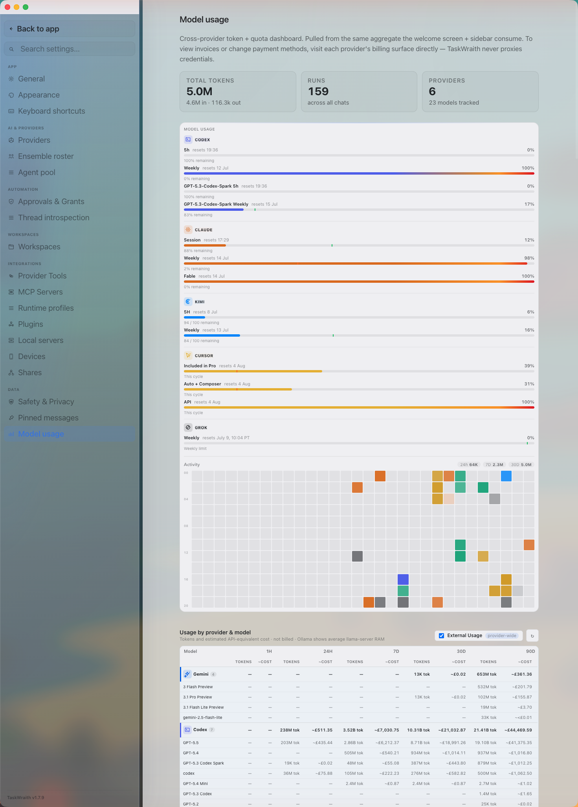

# How to: Model usage tab

**Platform:** Electron

## What it is
The Model usage tab is TaskWraith's usage dashboard across every provider: headline token and run totals, a quota card, per-model usage and cost, provider quota telemetry, API rate and context-length reference tables, and 90-day activity heatmaps and charts.

## Where to find it
Open **Settings → Data → Model usage**.

## How to use it
1. Check the headline tiles at the top for total tokens, total runs, and how many providers and models have tracked activity.
2. Review the quota card for each signed-in provider's rolling usage windows and reset times. For the Mistral Vibe seat the band is TaskWraith's own estimate — Mistral publishes no usage endpoint — and the same card also appears in the sidebar.
3. Scroll to **Usage by provider & model** for a per-model breakdown across 1H / 24H / 7D / 30D / 90D, with token counts and estimated (not billed) cost; toggle **External Usage** to include provider activity outside TaskWraith, and use the refresh button to re-fetch.
4. Check **Model Comparisons** for each model's share of tokens over the last 30 days, and **Provider Telemetry** for per-provider quota windows and balances (e.g. Grok credits), including how fresh each snapshot is.
5. Use **Provider/Model API Rates** and **Model Context Lengths** as the reference tables behind the cost estimates and context limits.
6. Scroll to the 90-day heatmaps and token charts to compare TaskWraith-tracked activity against external provider activity, filterable by provider.

## Tips & related
- [General tab](general-tab.md) — set your display currency and conservative cost overestimate percentage used here.
- [Providers tab](providers-tab.md) — sign in to providers so their usage and quota data populate this tab.
- [Welcome Screen](../getting-started/welcome-screen.md) — shows a lighter-weight usage dashboard and heatmaps for quick reference.
