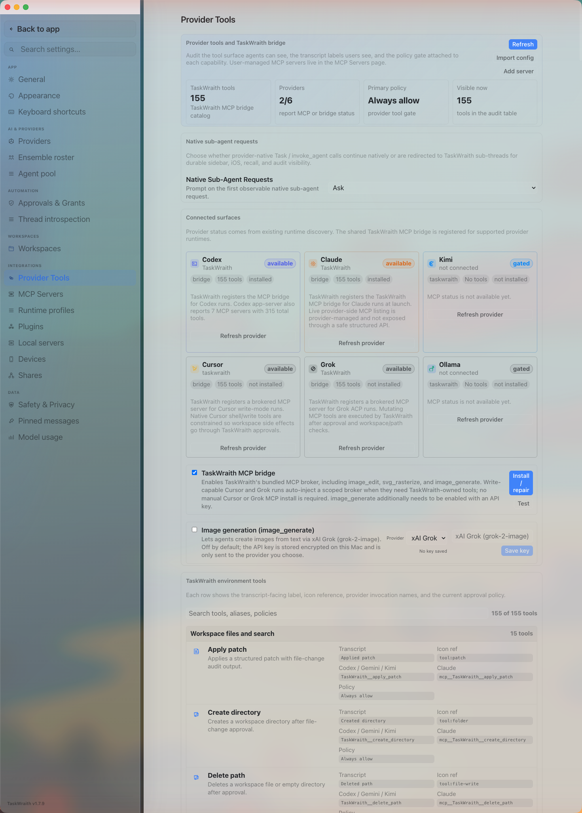

# How to: Provider tools tab

**Platform:** Electron

## What it is
Provider Tools is an audit page for TaskWraith's own tool surface: the built-in MCP bridge status per provider, the full catalog of TaskWraith tools agents can call, the native sub-agent redirect policy, and the image-generation key card. It does not manage your own external MCP servers — that lives on the separate MCP Servers tab.

## Where to find it
**Settings → Integrations → Provider Tools**.

## How to use it
1. Open **Settings → Integrations → Provider Tools**.
2. Check the summary cards for the TaskWraith tool count, how many providers report MCP/bridge status, the primary tool policy, and how many tools are currently visible in the audit table.
3. Under **Native Sub-Agent Requests**, choose whether provider-native sub-agent calls (Task / invoke_agent) run natively (**Provider**), are redirected to durable TaskWraith sub-threads (**TaskWraith**), or prompt you the first time (**Ask**).
4. Under **Connected surfaces**, review each provider's card (state, source, tool count, installed/provider-managed status) and click **Refresh provider** to re-check one, or **Refresh** in the header to re-check all of them at once.
5. Enable the **TaskWraith MCP bridge** checkbox to let qualified Grok write-mode runs auto-inject TaskWraith-owned tools (such as image editing and SVG rasterization) without a manual MCP install; use **Install / repair** or **Test** as needed. Path-B Cursor deliberately does not receive TaskWraith host MCP injection — native Cursor tools only under the OS sandbox.
6. In the image-generation card, enable `image_generate` and add an API key for OpenAI or xAI — the tool stays off until both an enabled toggle and a configured key are present.
7. Search the **TaskWraith environment tools** table to inspect any tool's transcript label, icon reference, provider invocation name, and active approval policy.
8. Use **Open MCP Servers** in the lower grid to jump to managing your own external server definitions.

## Tips & related
- [MCP servers tab](mcp-servers-tab.md) — add, edit, and remove your own external MCP server definitions.
- [Providers tab](providers-tab.md) — sign in and check runtime health for runnable providers, including Path-B Cursor setup.
- [Safety and privacy tab](safety-and-privacy-tab.md) — set the approval policies that gate each tool listed here.
- [Model usage tab](model-usage-tab.md) — see token and cost activity for the providers these tools run under.
