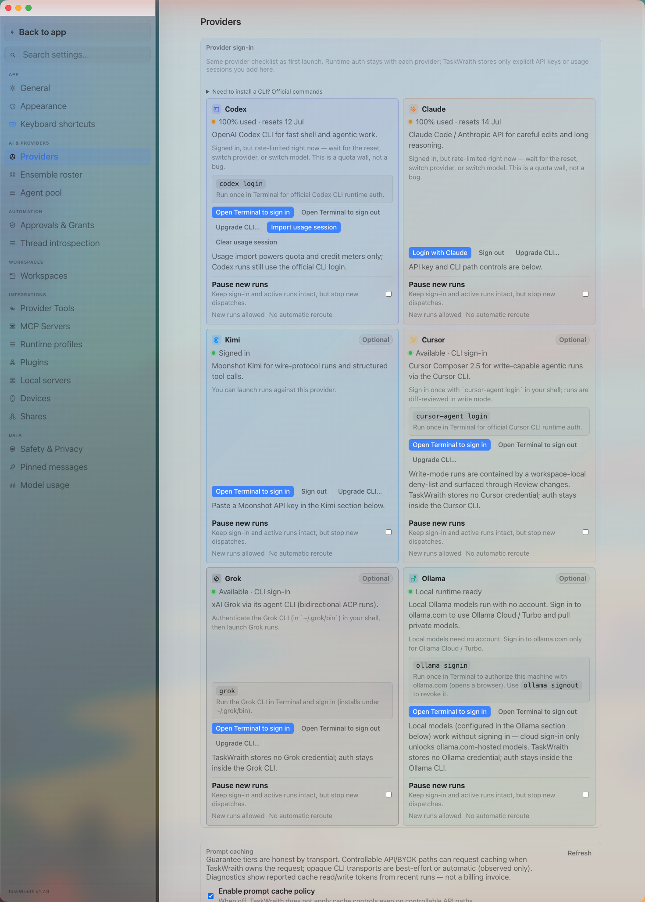

# How to: Providers tab

**Platform:** Electron

## What it is
The Providers tab is where you sign in to each AI provider, manage per-provider API keys and CLI paths, and set the agentic policies, pause/reroute rules, and audit-orchestration options that apply to every provider run.

## Where to find it
Open **Settings → AI & Providers → Providers**.

## How to use it
1. Open **Settings → AI & Providers → Providers** to see the provider
   checklist — sign-in/setup cards and current runtime status for the
   static-live Codex, Claude, Kimi, Cursor, Grok, Ollama, Pi, and Mistral
   providers.
   AntiGravity is conditionally offered after its consent/credential setup; the
   older standalone Gemini provider may remain only as historical
   configuration/history.
   Expand **Need to install a CLI?** for setup commands offered by runnable
   providers.
2. Sign in to or configure a runnable provider from its card: Codex, Grok, Cursor, and Ollama use **Open Terminal to sign in / sign out** (runs the provider's own CLI login), Claude uses **Login with Claude** (opens a browser) or an API key, AntiGravity uses your Gemini API key (its separately consented `agy` CLI lane adds **Open Terminal to sign in / sign out** plus an **Upgrade CLI…** action that runs the official user-installed updater), Kimi uses **Open Terminal to sign in** for Kimi Code, Pi uses configured upstream API keys, and Mistral sets up its plan/credential through the official Vibe wizard (Vibe exposes no bounded logout command). The Codex action sets `CODEX_HOME` to TaskWraith's stable private home under Electron `userData`; use it once instead of a bare `codex login`, then click **Refresh sign-in status**. This keeps TaskWraith rollouts and native session state outside the Codex app's catalog. TaskWraith and user MCP servers are attached at launch, while native Codex config/plugins remain deliberately separate. Kimi login/upgrade terminals are explicit user-owned setup handoffs; success does not qualify the binary for a managed run. Kimi exposes no bounded logout command, so TaskWraith does not open a bare Kimi session as a substitute. Cursor's current Path-B route uses the ordinary `cursor-agent login` flow.
3. Under **Agentic services**, set the policy (ask, always allow, or block) for shell commands, file changes, provider tools, sub-thread delegation, canvas interaction, media editing, and network access — see [Provider Agentic Policies](../approvals-and-permissions/provider-agentic-policies.md) for the full matrix.
4. Set **Codex sandbox fallback** to control whether TaskWraith offers to rerun a Codex command from the host process after a Swift/Xcode sandbox collision.
5. Under **Audit role providers** and **Audit budget**, choose which providers `/audit` can fall back to beyond the parent chat's provider, and optionally cap the max agents or tokens an audit run can spend.
6. Scroll to each provider's own section (Claude, Kimi, Local/Ollama) to review its transport-specific controls or override its CLI binary path. Managed Kimi execution is ACP-only: every build applies structural identity, bounded-probe, and ACP-posture admission, uses a private synthetic cwd, and reaches the workspace only through an authenticated per-run TaskWraith gateway. There is no Wire/print fallback. The source-ahead embedded reviewed roster is currently empty, so a structurally admitted packaged run is labelled `unattested-development`; a reviewed tuple upgrades that evidence label. Ollama also has an **endpoint** field and a **Default local model** picker pulled from your locally installed models.
7. On any provider card, use **Pause new runs** to stop new dispatches to that provider while leaving sign-in and active runs untouched — optionally set an **Until** time, a **Reason**, and a **Reroute while paused** provider/model/approval fallback so new runs go elsewhere automatically.

Cursor is in the user-approved live set. Its current Path-B route works in solo
chats, Ensembles, and delegated runs with native tools plus TaskWraith tools.
Permission presets and workspace Tool Grants apply to TaskWraith-mediated
calls; see [Safety and privacy](safety-and-privacy-tab.md) for the
provider-native boundary.

## Tips & related
- [Provider Agentic Policies](../approvals-and-permissions/provider-agentic-policies.md) — full detail on the Agentic services policy matrix edited here.
- [Provider Tools tab](provider-tools-tab.md) — MCP bridge status, built-in tool catalog, and image-generation key card (Settings → Integrations).
- [Safety and privacy tab](safety-and-privacy-tab.md) — read-only risk-posture summary with deep-links back to this tab.
- [Model usage tab](model-usage-tab.md) — token/cost activity for providers you sign in to here.
