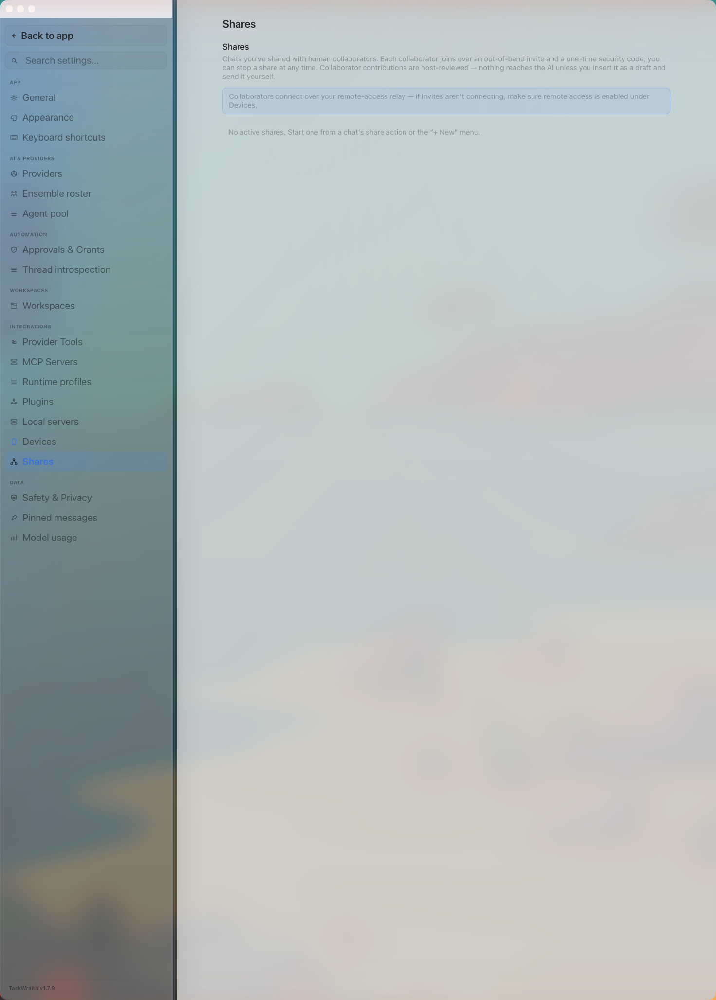

# How to: Shares tab

**Platform:** Electron

## What it is
The Shares tab lists chats you've shared with human collaborators. Each entry shows the share's contribution rules, its participants and their live connection state, any open invites, and lets you change the rules, stop the share, or remove a single collaborator. Collaborator contributions are host-reviewed — nothing reaches the AI unless you insert it as a draft and send it yourself.

## Where to find it
**Settings → Integrations → Shares**

## How to use it
1. Open **Settings → Integrations → Shares** to see every chat you currently have shared.
2. Each card shows the chat title, its contribution rules, and its connection state (**Live**, **Offline**, **Invite issued**, or **Not connected**). Each active collaborator also carries their own **Live**/**Offline** chip.
3. Use the rules picker on a card to change what collaborators may do: **View only**, **Comments — host-reviewed before AI**, **Request host action — host-reviewed**, or **Auto-draft — you still send** (action requests pre-fill your composer as a draft; nothing ever sends itself).
4. Click **Copy invite** to generate a fresh out-of-band invite for that share — paste it to the collaborator yourself.
5. Under a card's participant list, each collaborator shows their own status (**Active**, **Pending**, or **Removed**); click **Remove** next to a collaborator to revoke just their access.
6. Click **Stop sharing** to revoke the whole share immediately; all collaborators lose access at once.

## Tips & related
- Collaborators connect over your remote-access relay, so make sure remote access is enabled on the [Devices tab](devices-tab.md) before sending an invite.
- [Shares popover](../footer-control-row/shares-popover.md) — quick glance at active shares from the sidebar footer.
- Start a new share from a chat's share action or the sidebar's "+ New" menu ("New Shared Chat" / "Join Shared Chat").
