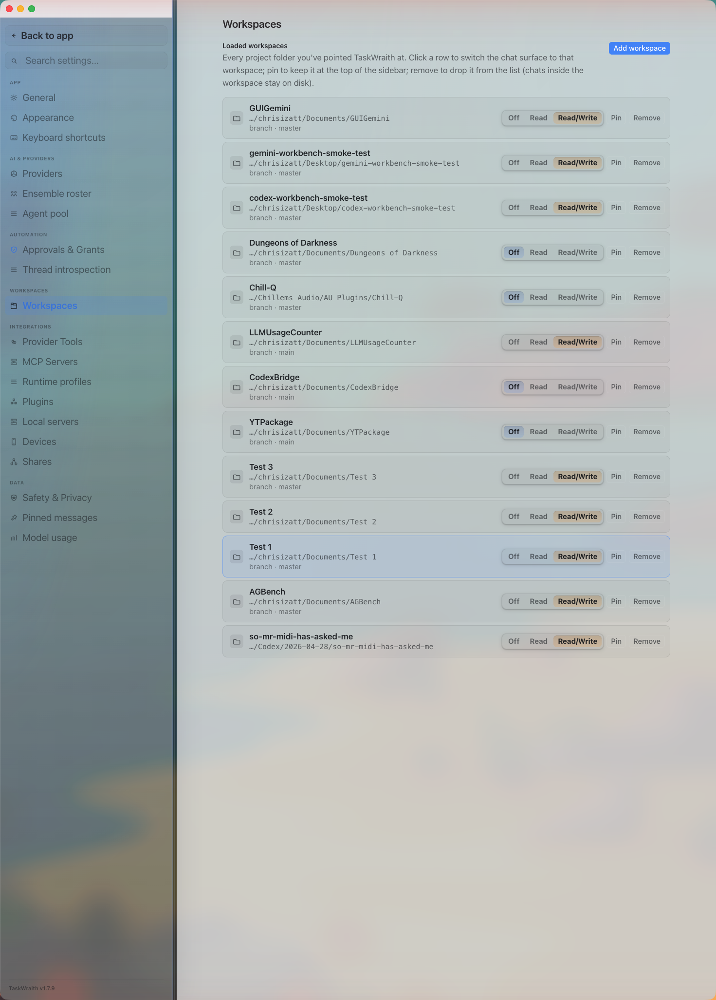

# How to: Workspaces tab

**Platform:** Electron

## What it is
The Workspaces tab lists every project folder you've pointed TaskWraith at. From here you can switch the chat surface to a workspace, pin it to the top of the sidebar, remove it from the list, or grant it remote (paired-device) access.

## Where to find it
**Settings → Workspaces → Workspaces**.

## How to use it
1. Click **Add workspace** to open a folder picker and register a new project folder.
2. Click a workspace row to switch the chat surface to that workspace (chats inside a removed workspace stay on disk, so removing it is non-destructive).
3. Use the **Off / Read / Read/Write** segmented control on a row to set what paired iPhones/iPads can do in that workspace: Off shares no chat content, Read lets a phone monitor and approve runs, and Read/Write enables the standard remote workspace actions. The grant is universal across every provider currently admitted by the Mac and persists until you set it to Off; it is separate from each thread's Plan, Ask, Accept Edits, Full WS Access, or Full Access preset.
4. Click **Pin** to keep a workspace at the top of the sidebar, or **Unpin** to release it.
5. Click **Remove** to drop a workspace from the list.

## Tips & related
- [Devices tab](devices-tab.md) — manage paired devices and review the full remote-access allowlist across all workspaces.
- [General tab](general-tab.md) — other core app behavior and defaults.
