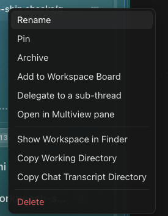

# How to: Overflow Menus

**Platform:** Electron

## What it is
The per-item menu in the sidebar. On a workspace it offers **New chat**, **Pin** / **Unpin**, **Show Workspace in Finder**, **Copy Working Directory**, and **Remove workspace**. On a chat it offers **Rename**, **Duplicate**, **Pin** / **Unpin**, **Archive**, **Delegate to a sub-thread**, **Open in Multiview pane**, and **Delete** — plus **Open beside parent** and **Open drawer beside parent** on a sub-thread.

## Where to find it
On any workspace or chat row in the sidebar.

## How to use it
1. Hover over the workspace or chat you want.
2. Click the **⋯** button, or right-click the row.
3. Click the action you want.

## Tips & related
- **Remove workspace** and **Delete** only affect TaskWraith's list and history — your files stay where they are.
- [Sub-thread delegation](../chats-and-threads/sub-thread-delegation.md)
- [Side chat](../chats-and-threads/side-chat.md)
- [Canvas multiview pane](../canvas-and-previews/canvas-multiview-pane.md)
