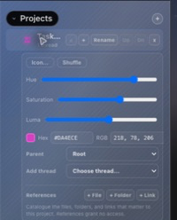

# How to: Project Reference Library

**Platform:** Electron

## What it is
Each Project can keep a small catalogue of the files, folders, and web links
that matter to it. References are organizational metadata: adding one does not
grant an agent access, read or index its content, fetch a link, or inject
anything into a run.

## Where to find it
Select **Work**, then select a Project. The **References** controls appear in
that Project's expanded detail panel.

## How to use it
1. Click **+ File** or **+ Folder** and choose an item to catalogue its locator,
   or click **+ Link** and enter an `https://` URL.
2. For a file or folder, click **✓** to record whether it currently exists.
   Verification performs an existence check only; links are never fetched.
3. Click **Off** to exclude an entry from the available library, and click it
   again to restore the entry.
4. Click **−** to remove the reference record.

## Tips & related
- A reference is not an external-path grant. The normal per-chat/per-run
  permission flow still governs agent access.
- [Sidebar sections](sidebar-sections.md) explains the Chat, Code, and Work
  surfaces.
- [Workspace and chat tree](workspace-and-chat-tree.md) covers the separate
  workspace hierarchy under Code.
