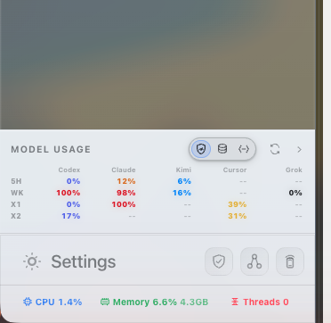

# How to: Settings Entry

**Platform:** Electron

## What it is
The gear button that opens Settings, where you sign in to providers, change how the app looks, edit shortcuts, and set approval rules.

## Where to find it
In the sidebar footer, at the bottom-left of the window.

## How to use it
1. Click the **Settings** (gear) button in the sidebar footer.
2. Settings takes over the main window.
3. Pick a tab from the rail on the left, or type in its search box to jump straight to a setting.

## Tips & related
- Tabs are grouped as **App**, **AI & Providers**, **Automation**, **Workspaces**, **Integrations**, and **Data**.
- [General tab](../settings-and-configuration/general-tab.md) — core behavior settings.
- [Providers tab](../settings-and-configuration/providers-tab.md) — sign in and configure AI providers.
