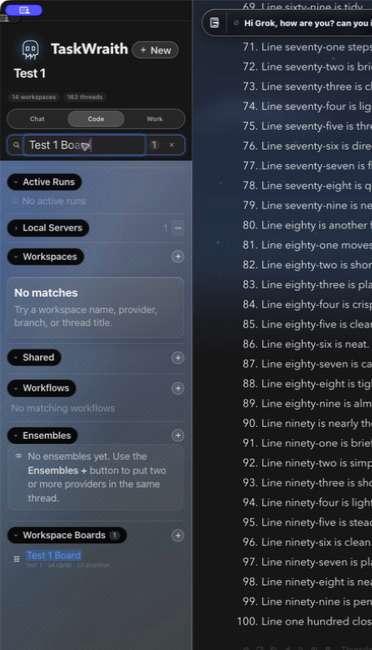

# How to: Sidebar Search

**Platform:** Electron

## What it is
A quick-search field scoped to the active sidebar surface. **Chat** searches General chats, **Code** searches workspaces and their threads (including matching workspace workflows and boards), and **Work** searches Projects and their member chats. Each surface keeps its own query while you switch between tabs.

## Where to find it
Immediately below the **Chat / Code / Work** switcher. Press **⌘⇧F** on macOS (or the shortcut shown in the field on your platform) to focus it, or click the field.

## How to use it
1. Select the surface you want to search: Chat, Code, or Work.
2. Focus the search field and type a chat, workspace, thread, project, or project-member name appropriate to that surface.
3. Click a result to jump to it. Press **Escape** once to clear a query and again to leave the field.

## Tips & related
- [In-chat search](../chats-and-threads/in-chat-search.md) — search inside a single transcript.
- [Sidebar sections](sidebar-sections.md) — understand the sidebar layout before searching.
