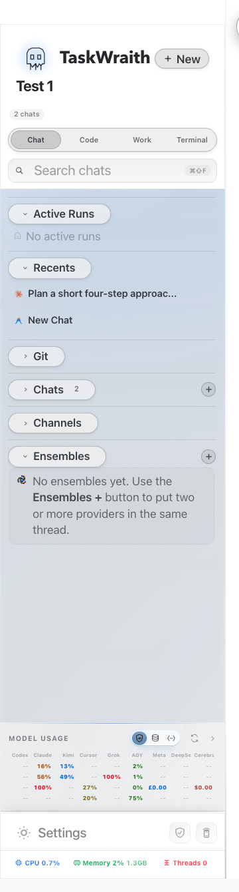

# How to: Sidebar Sections

**Platform:** Electron

## What it is
The sidebar starts with three primary surfaces: **Chat**, **Code**, and **Work**. Chat shows General chats; Code shows workspace-scoped threads and workspace tools; Work opens the **Projects** organizer. Chat and Code show the sections relevant to that surface, such as Active Runs, Pinned, Recents, Ensembles, Channels, Workflows, Workspace Boards, Workspaces, and Local Servers. Some remain visible in an empty state so their create action or status is still reachable. Section headers can be collapsed and reordered.

## Where to find it
In the **left sidebar panel** of the TaskWraith main window.

## How to use it
1. Pick **Chat**, **Code**, or **Work** to choose the scope you want to navigate.
2. In Chat or Code, click a section header to collapse or expand it, or drag headers to reorder them.
3. In Work, the **Projects** header stays open. Select a project to view its members and details, and expand project rows that contain child projects.
4. TaskWraith remembers the active surface, section order, and collapsed state across launches.

## Tips & related
- [Workspace and chat tree](workspace-and-chat-tree.md) — the workspace hierarchy in Code.
- [Sidebar search](sidebar-search.md) — search within the current Chat, Code, or Work surface.
