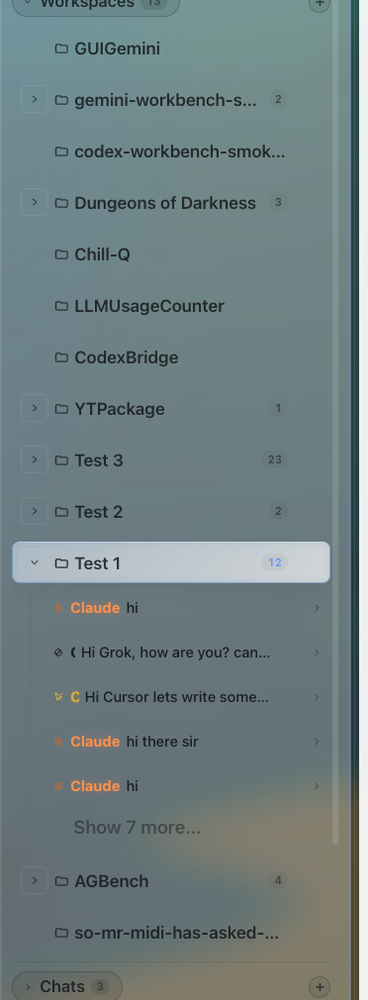

# How to: Workspace and Chat Tree

**Platform:** Electron

## What it is
The workspace tree shows your loaded workspaces, their chats, and sub-threads (indented with a ↳ glyph). You can collapse parent workspaces to tidy the view.

## Where to find it
In the **Sidebar**, under the **Workspaces** and **Chats** sections.

## How to use it
1. Expand a workspace to see its chats.
2. Look for the ↳ indent to identify sub-threads.
3. Click the chevron to collapse a workspace when you need less clutter.

## Tips & related
- [Sub-thread delegation](../chats-and-threads/sub-thread-delegation.md)
- [Overflow menus](overflow-menus.md) for actions on a workspace or chat.
