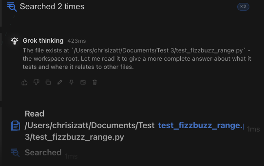

# How to: Activity stack

**Platform:** Electron

## What it is
A collapsible list of tool calls an agent makes during a turn. Similar calls group together to keep long runs tidy.

## Where to find it
In the transcript, under an agent's turn, wherever tools were used.

## How to use it
1. Click a row to expand it and see details like file paths, commands, or search queries.
2. Click an open row again to collapse it.
3. Hold ⌘ or Shift while clicking to keep multiple rows open at once.
4. In an ensemble, watch for the "yielding to @<name>" row to see which participant runs next.
5. Turn on **Live activity viewport** in Settings → Appearance → Effects & Material → Density for a live scrolling view while the agent works.
6. Turn on **Compact density** in the same place to make tool cards more compact.

## Tips & related
- [Transcript message stream](transcript-message-stream.md) — the main chat view the stack appears in
- [Inspector panel](inspector-panel.md) — view raw events and full diffs
- [Diff hover preview](diff-hover-preview.md) — preview a file diff without expanding
- [File changes row](file-changes-row.md) — see all file changes for a chat
