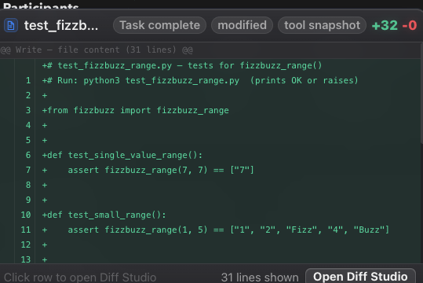

# How to: Diff hover preview

**Platform:** Electron

## What it is
A floating popover that shows a code diff for a file change without leaving the transcript. It appears when you hover or focus a diff-capable row.

## Where to find it
It appears in three places:
- Rows in the **File changes** card above the composer.
- Edit-type rows in the **activity stack** when they contain diff text.
- Inline commit hashes written in message text.

## How to use it
1. Hover a changed-file row or an edit-type activity row to open the preview.
2. Keep it open by moving your pointer onto the popover itself.
3. Press Tab to focus the row; the preview opens and can be dismissed with **Escape**.
4. If an action button appears in the footer, click it to open the full diff in Diff Studio.
5. Scrolling the transcript or resizing the window closes the preview.

## Tips & related
- [File changes row](file-changes-row.md) — the summary card that hosts most previews
- [Activity stack](activity-stack.md) — collapsible tool-call rows that also trigger previews
- [Inspector panel](inspector-panel.md) — full Diff view for deeper inspection
